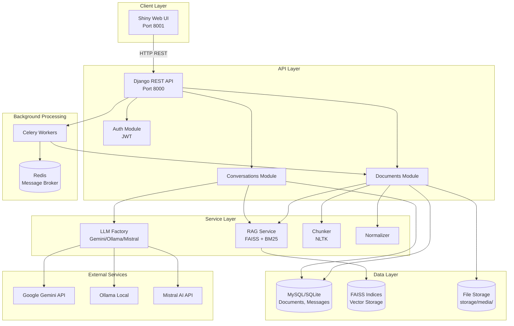
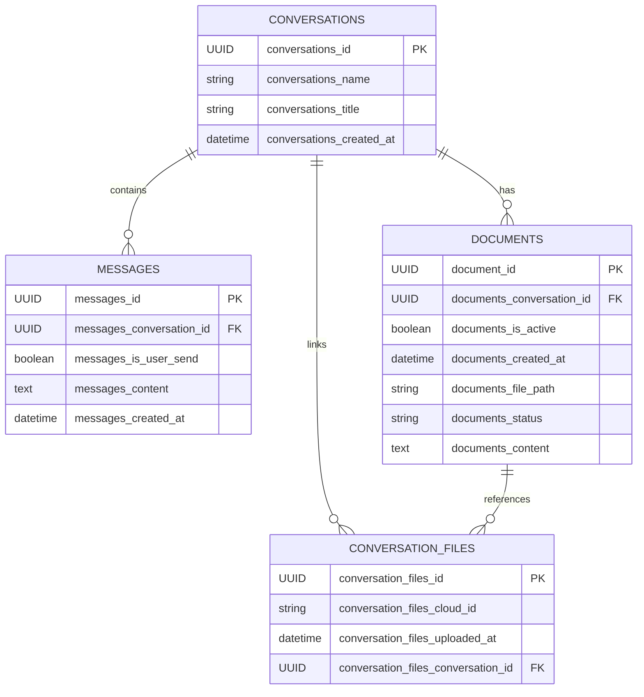

# BÁO CÁO PHÂN TÍCH DỰ ÁN SMARTDOCS AI

**Ngày phân tích:** 20/06/2026  
**Phân tích bởi:** Kiro AI Assistant  
**Mục đích:** Tạo hồ sơ thông tin đầy đủ để viết báo cáo đồ án tốt nghiệp ngành Công nghệ thông tin

---

## MỤC LỤC

1. [TỔNG QUAN DỰ ÁN](#phần-1-tổng-quan-dự-án)
2. [CẤU TRÚC THƯ MỤC VÀ FILE](#phần-2-cấu-trúc-thư-mục-và-file)
3. [CÔNG NGHỆ VÀ THƯ VIỆN](#phần-3-công-nghệ-và-thư-viện-sử-dụng)
4. [PHÂN TÍCH CHỨC NĂNG HỆ THỐNG](#phần-4-phân-tích-chức-năng-hệ-thống)
5. [PIPELINE XỬ LÝ TÀI LIỆU VÀ AI](#phần-5-phân-tích-pipeline-xử-lý-tài-liệu-và-ai)
6. [KIẾN TRÚC HỆ THỐNG](#phần-6-phân-tích-kiến-trúc-hệ-thống)
7. [PHÂN TÍCH API](#phần-7-phân-tích-api)
8. [GIAO DIỆN NGƯỜI DÙNG](#phần-8-phân-tích-giao-diện-người-dùng)
9. [DATABASE / LƯU TRỮ DỮ LIỆU](#phần-9-phân-tích-database--lưu-trữ-dữ-liệu)
10. [THUẬT TOÁN / LOGIC CHÍNH](#phần-10-phân-tích-thuật-toán--logic-chính)
11. [BẢO MẬT VÀ XỬ LÝ LỖI](#phần-11-phân-tích-bảo-mật-lỗi-và-giới-hạn)
12. [CÀI ĐẶT VÀ TRIỂN KHAI](#phần-12-cài-đặt-chạy-thử-và-triển-khai)
13. [KẾT QUẢ THỰC NGHIỆM](#phần-13-kết-quả-thực-nghiệm--đánh-giá)
14. [SƠ ĐỒ HỆ THỐNG](#phần-14-sơ-đồ-cần-tạo-cho-báo-cáo)

---

## PHẦN 1. TỔNG QUAN DỰ ÁN

### 1.1. Tên dự án

**Tên chính thức:** SmartDocs AI  
**Tên đề tài đề xuất cho báo cáo:**

> **"XÂY DỰNG HỆ THỐNG SMARTDOCS AI HỖ TRỢ TRẢ LỜI CÂU HỎI TỪ TÀI LIỆU SỬ DỤNG RAG VÀ MÔ HÌNH NGÔN NGỮ LỚN"**

hoặc

> **"PHÁT TRIỂN ỨNG DỤNG SMARTDOCS: HỆ THỐNG TRỢ LÝ ẢO THÔNG MINH ĐỌC HIỂU VÀ TRẢ LỜI CÂU HỎI TỪ TÀI LIỆU PDF/DOCX SỬ DỤNG CÔNG NGHỆ RAG VÀ AI"**

### 1.2. Mục tiêu của hệ thống

SmartDocs AI là hệ thống hỗ trợ người dùng **đọc hiểu, phân tích và trả lời câu hỏi từ tài liệu** một cách tự động bằng công nghệ AI. Hệ thống cho phép:

- Tải lên tài liệu PDF, DOCX hoặc file văn bản
- Tự động trích xuất, phân tích và lưu trữ nội dung dưới dạng vector embeddings
- Trả lời câu hỏi của người dùng dựa trên nội dung tài liệu đã tải lên
- Cung cấp giao diện web thân thiện để tương tác với tài liệu qua hội thoại
- Hỗ trợ nhiều mô hình AI (Gemini, Ollama, Mistral) để đảm bảo tính linh hoạt

### 1.3. Bài toán giải quyết

Hệ thống giải quyết bài toán **truy xuất thông tin từ tài liệu lớn** và **trả lời câu hỏi tự nhiên** (Question Answering) dựa trên nội dung tài liệu:

- **Vấn đề:** Người dùng phải đọc toàn bộ tài liệu dài để tìm thông tin cụ thể → mất thời gian, không hiệu quả
- **Giải pháp:** Sử dụng công nghệ RAG (Retrieval-Augmented Generation) kết hợp với LLM để:
  - Trích xuất ngữ cảnh liên quan từ tài liệu dựa trên câu hỏi
  - Tạo câu trả lời chính xác, có căn cứ từ tài liệu gốc
  - Giảm thiểu hallucination (AI bịa đặt thông tin không có trong tài liệu)

### 1.4. Đối tượng người dùng

- **Sinh viên:** tra cứu thông tin từ giáo trình, tài liệu học tập
- **Nhân viên văn phòng:** tìm kiếm thông tin từ báo cáo, hợp đồng, tài liệu công ty
- **Nhà nghiên cứu:** phân tích tài liệu khoa học, paper, luận văn
- **Người dùng phổ thông:** cần hiểu nội dung tài liệu phức tạp một cách nhanh chóng

### 1.5. Phạm vi chức năng

Hệ thống cung cấp các chức năng chính:

1. **Quản lý tài liệu:** Upload, index, xóa tài liệu
2. **Quản lý hội thoại:** Tạo conversation, gửi/nhận message, xem lịch sử
3. **Xử lý tài liệu:** Trích xuất text, chuẩn hóa, phân đoạn (chunking), tạo embedding
4. **Truy xuất ngữ cảnh:** Tìm kiếm ngữ nghĩa (semantic search) bằng FAISS vector database
5. **Tạo câu trả lời:** Gọi LLM (Gemini/Ollama/Mistral) để tạo câu trả lời dựa trên ngữ cảnh
6. **Xác thực người dùng:** Đăng ký, đăng nhập, quản lý phiên làm việc bằng JWT

### 1.6. Đầu vào và đầu ra

**Đầu vào:**
- **Tài liệu:** File PDF, DOCX, TXT (upload local hoặc từ Google Drive)
- **Câu hỏi người dùng:** Văn bản tiếng Anh hoặc tiếng Việt
- **Cấu hình:** Provider AI (auto/gemini/ollama/mistral), model name, system prompt

**Đầu ra:**
- **Câu trả lời AI:** Văn bản trả lời câu hỏi dựa trên tài liệu
- **Metadata:** Provider, model, thời gian xử lý (embed_ms, query_ms, response_ms, total_ms)
- **Retrieval hits:** Danh sách đoạn văn liên quan được truy xuất từ tài liệu
- **Trạng thái tài liệu:** uploaded, processing, indexed, failed

### 1.7. Tóm tắt hệ thống (dùng cho Lời mở đầu)

SmartDocs AI là hệ thống hỗ trợ đọc hiểu tài liệu thông minh, cho phép người dùng tải lên tài liệu PDF/DOCX và đặt câu hỏi về nội dung tài liệu đó. Hệ thống sử dụng công nghệ RAG (Retrieval-Augmented Generation) kết hợp FAISS vector database và các mô hình ngôn ngữ lớn (LLM) như Google Gemini, Ollama, Mistral để tự động trích xuất ngữ cảnh liên quan và tạo câu trả lời chính xác. Kiến trúc client-server với backend Django REST API và frontend Shiny for Python đảm bảo khả năng mở rộng và bảo trì tốt. Hệ thống hỗ trợ xử lý bất đồng bộ bằng Celery, lưu trữ vector embeddings bằng FAISS, và quản lý phiên làm việc bằng JWT authentication.

---

## PHẦN 2. CẤU TRÚC THƯ MỤC VÀ FILE

### 2.1. Cấu trúc tổng quan

```
py_smartdocs/
├── app/                    # Django project settings
├── backend/                # Backend API + business logic
│   ├── api/                # REST API endpoints (views + urls)
│   ├── apps/               # Core application logic
│   └── requirements/       # Python dependencies
├── frontend/               # Shiny for Python web UI
│   ├── apps/               # Message logic
│   ├── components/         # UI components
│   └── services/           # Frontend services
├── sys_services/           # System utilities (logging, config, API client)
├── storage/                # Uploaded files
├── metadata/               # FAISS indices + document metadata
├── tests/                  # Test files
├── docker-compose.yml      # Production deployment config
├── Dockerfile              # Backend container
├── manage.py               # Django CLI
└── .env                    # Environment variables
```

### 2.2. Bảng phân tích chi tiết

| Thư mục/File | Vai trò | Nội dung chính | Mức độ quan trọng |
|--------------|---------|----------------|-------------------|
| **manage.py** | Django CLI | Entry point chạy Django commands | ⭐⭐⭐⭐⭐ |
| **docker-compose.yml** | Deployment | Định nghĩa services: backend, frontend, redis, celery, celery-beat | ⭐⭐⭐⭐⭐ |
| **app/settings/local.py** | Django config | Cấu hình Django, database, CORS, Celery, middleware | ⭐⭐⭐⭐⭐ |
| **app/urls.py** | URL routing | Delegate tất cả routes tới backend/api/urls.py | ⭐⭐⭐⭐⭐ |
| **backend/api/urls.py** | API router | Định nghĩa các endpoint: /api/health/, /api/auth/, /api/documents/, /api/conversations/ | ⭐⭐⭐⭐⭐ |
| **backend/api/documents/views.py** | Document API | Upload, index, delete, get status của document | ⭐⭐⭐⭐⭐ |
| **backend/api/conversations/views.py** | Conversation API | Tạo conversation, gửi message, RAG retrieval, gọi LLM | ⭐⭐⭐⭐⭐ |
| **backend/api/auth/views.py** | Auth API | Signup, login, logout, refresh token, JWT authentication | ⭐⭐⭐⭐ |
| **backend/apps/llm/** | LLM providers | GeminiClient, OllamaClient, MistralClient - gọi AI models | ⭐⭐⭐⭐⭐ |
| **backend/apps/core/chunk/chunker.py** | Text chunking | Chia văn bản thành chunks bằng NLTKTextSplitter | ⭐⭐⭐⭐⭐ |
| **backend/apps/core/normalize/normalize.py** | Text normalization | Chuẩn hóa whitespace, loại bỏ ký tự dư thừa | ⭐⭐⭐⭐ |
| **backend/apps/services/rag_base/locate/faiss_service.py** | FAISS vector DB | Create, upsert, search, delete, load FAISS index | ⭐⭐⭐⭐⭐ |
| **backend/apps/services/rag_base/search/hybrid_search_service.py** | Hybrid search | Kết hợp FAISS + BM25 bằng RRF (Reciprocal Rank Fusion) | ⭐⭐⭐⭐ |
| **backend/apps/services/chat/models.py** | Django models | ConversationModel, DocumentModel, MessageModel, ConversationFilesModel | ⭐⭐⭐⭐⭐ |
| **backend/apps/tasks/** | Celery tasks | Background jobs cho indexing, conversation, upload | ⭐⭐⭐ |
| **frontend/app.py** | Shiny app | Main UI logic, reactive components, server functions | ⭐⭐⭐⭐⭐ |
| **frontend/apps/message.py** | Message handler | build_message(), send_message() - giao tiếp với backend API | ⭐⭐⭐⭐⭐ |
| **frontend/components/** | UI components | Header, chat box, sidebar, upload modal, settings | ⭐⭐⭐⭐ |
| **sys_services/api_client.py** | HTTP client | ApiClient class - gọi backend API từ frontend | ⭐⭐⭐⭐⭐ |
| **sys_services/read_config/** | Config loader | Đọc biến môi trường, config provider, models list | ⭐⭐⭐⭐ |
| **sys_services/logging.py** | Logger | Custom logging service | ⭐⭐⭐ |
| **.env.example** | Environment template | Template cho biến môi trường (API keys, DB config, v.v.) | ⭐⭐⭐⭐⭐ |
| **backend/requirements/base.txt** | Dependencies | Django, LangChain, FAISS, pypdf, Celery, Redis, v.v. | ⭐⭐⭐⭐⭐ |
| **frontend/requirements/dev.txt** | Frontend deps | Shiny, httpx, python-dotenv | ⭐⭐⭐⭐ |

### 2.3. File chạy chính

**Backend:**
- **File:** `manage.py`
- **Chức năng:** Django management CLI
- **Command chạy development:** `python manage.py runserver`
- **Command production:** `gunicorn app.asgi:application --bind 0.0.0.0:8000 --workers 4 --worker-class uvicorn.workers.UvicornWorker`

**Frontend:**
- **File:** `frontend/app.py`
- **Chức năng:** Shiny for Python web application
- **Command chạy:** `shiny run --app-dir frontend --reload` (development)

**Celery Worker:**
- **Command:** `celery -A backend.apps.tasks worker --loglevel=info`
- **Chức năng:** Xử lý background tasks (indexing documents)

**Celery Beat:**
- **Command:** `celery -A backend.apps.tasks beat --loglevel=info`
- **Chức năng:** Scheduled tasks

---

## PHẦN 3. CÔNG NGHỆ VÀ THƯ VIỆN SỬ DỤNG

### 3.1. Ngôn ngữ và phiên bản

- **Ngôn ngữ:** Python
- **Phiên bản Python:** 3.13+ (dựa trên Dockerfile: `FROM python:3.13-slim`)
- **Lý do chọn Python:** Hệ sinh thái AI/ML mạnh, thư viện phong phú (LangChain, FAISS, pypdf), dễ tích hợp với LLM APIs

### 3.2. Framework Backend

| Framework | Phiên bản | Vai trò | File sử dụng |
|-----------|-----------|---------|--------------|
| **Django** | 5.2.7 | Web framework, ORM, URL routing | `app/settings/`, `manage.py` |
| **Django REST Framework** | 3.16.1 | REST API views, serialization | `backend/api/*/views.py` |
| **django-cors-headers** | 4.9.0 | CORS middleware cho frontend | `app/settings/local.py` |
| **Gunicorn** | 26.0.0 | WSGI server cho production | `docker-compose.yml`, `Dockerfile` |
| **Uvicorn** | 0.49.0 | ASGI worker cho async support | `docker-compose.yml` |

**Ghi chú:** Django được chọn vì tích hợp ORM tốt, hỗ trợ authentication, middleware system mạnh mẽ, và REST Framework cung cấp công cụ xây dựng API nhanh chóng.

### 3.3. Framework Frontend

| Framework | Vai trò | File sử dụng |
|-----------|---------|--------------|
| **Shiny for Python** | Web UI framework (reactive components) | `frontend/app.py`, `frontend/components/` |
| **httpx** | HTTP client để gọi backend API | `sys_services/api_client.py` |

**Ghi chú:** Shiny được chọn vì dễ xây dựng UI reactive, tích hợp tốt với Python backend, không cần JavaScript framework riêng.

### 3.4. Thư viện xử lý tài liệu

| Thư viện | Phiên bản | Vai trò | File sử dụng | Ghi chú |
|----------|-----------|---------|--------------|---------|
| **pypdf** | 5.4.0 | Đọc file PDF, extract text | `backend/api/documents/views.py` (method `_extract_text`) | Đọc từng page của PDF |
| **python-docx** | (Implicit via zipfile + xml) | Đọc file DOCX | `backend/api/documents/views.py` | Parse XML từ DOCX |
| **pytesseract** | (Không tìm thấy trong code) | OCR ảnh | Chưa tìm thấy trong mã nguồn | Có thể sử dụng Mistral OCR API thay thế |

**Ghi chú:** Hệ thống hiện chỉ hỗ trợ PDF text-based và DOCX. Không phát hiện OCR cho PDF scan hoặc ảnh trong code hiện tại, nhưng có tích hợp Mistral OCR API (xem `.env.example`).

### 3.5. Thư viện AI/NLP/LLM

| Thư viện | Phiên bản | Vai trò | File sử dụng | Ghi chú |
|----------|-----------|---------|--------------|---------|
| **LangChain** | 0.3.27 | Text splitting, chain orchestration | `backend/apps/core/chunk/chunker.py` | Dùng NLTKTextSplitter |
| **google-genai** | Latest | Google Gemini API client | `backend/apps/llm/gemini.py` | Embedding + text generation |
| **ollama** | Latest | Ollama local LLM client | `backend/apps/llm/ollama.py` | Support local models như qwen2.5:3b |
| **mistralai** | Latest | Mistral AI API client | `backend/apps/llm/mistral.py` | OCR + text generation |
| **neo4j-graphrag** | Latest | Graph-based RAG (experimental) | `backend/apps/llm/*.py` | LLMInterface, Embedder |
| **NLTK** | Latest | Text tokenization | `chunker.py` (via LangChain) | Sentence splitting |
| **PyVi** | Latest | Vietnamese NLP | (Không rõ sử dụng ở đâu) | Hỗ trợ tiếng Việt |
| **rank-bm25** | Latest | BM25 keyword search | `backend/apps/services/rag_base/locate/bm25_service.py` | Sparse vector search |

**Ghi chú về LLM providers:**
- **Gemini:** Sử dụng cho embedding (gemini-embedding-2-preview) và text generation (gemini-2.5-flash)
- **Ollama:** Chạy local models, mặc định qwen2.5:3b
- **Mistral:** Dùng cho OCR (mistral-ocr-latest) và text generation

### 3.6. Vector Database / Embedding Storage

| Thư viện | Phiên bản | Vai trò | File sử dụng | Ghi chú |
|----------|-----------|---------|--------------|---------|
| **faiss-cpu** | Latest | Vector similarity search (FAISS index) | `backend/apps/services/rag_base/locate/faiss_service.py` | IndexFlatL2, IndexIDMap |
| **qdrant-client** | 1.15.1 | Qdrant vector database client | `backend/apps/services/rag_base/locate/locate_service.py` | Experimental, chưa dùng chính |
| **langchain-qdrant** | 0.2.1 | LangChain integration cho Qdrant | Chưa rõ sử dụng | Có trong requirements nhưng chưa thấy dùng |

**Ghi chú:** 
- **FAISS** là vector database chính được sử dụng (local file-based)
- **Qdrant** có cấu hình nhưng chưa tìm thấy implementation rõ ràng
- Metadata được lưu trong `backend/metadata/faiss/` (FAISS index files) và `backend/metadata/docs/` (JSON metadata)

### 3.7. Database

| Database | Phiên bản | Vai trò | File cấu hình | Ghi chú |
|----------|-----------|---------|---------------|---------|
| **SQLite** | Default | Development database | `app/settings/local.py` (fallback) | File: `db.sqlite3` |
| **MySQL/MariaDB** | Latest | Production database | `docker-compose.yml`, `.env` | DB_ENGINE=django.db.backends.mysql |
| **Redis** | 7-alpine | Message broker + cache | `docker-compose.yml` | Dùng cho Celery |

**Driver:** `mariadb` (Python MySQL client library)

### 3.8. Background Tasks

| Thư viện | Phiên bản | Vai trò | File sử dụng |
|----------|-----------|---------|--------------|
| **Celery** | 5.5.3 | Distributed task queue | `app/settings/local.py`, `backend/apps/tasks/` |
| **Redis** | 6.4.0 | Celery broker + result backend | `app/settings/local.py` |
| **kombu** | 5.5.4 | Message serialization | (Celery dependency) |

**Ghi chú:** Celery được cấu hình với 2 queues:
- `indexing`: Xử lý document indexing tasks
- `default`: Các tasks khác

### 3.9. Utilities

| Thư viện | Vai trò |
|----------|---------|
| **python-dotenv** | Load .env variables |
| **loguru** | Advanced logging |
| **tenacity** | Library cho retry pattern (đã cài đặt, chưa tích hợp) |
| **orjson** | Fast JSON serialization |
| **numpy** | Array operations cho embeddings |
| **PyJWT** | JWT token encoding/decoding |
| **sentry-sdk** | Error tracking (optional) |
| **certifi** | SSL certificate handling |

### 3.10. Deployment Tools

| Tool | Vai trò | File liên quan |
|------|---------|----------------|
| **Docker** | Containerization | `Dockerfile` |
| **Docker Compose** | Multi-container orchestration | `docker-compose.yml` |
| **Nginx** | Reverse proxy (future) | `nginx.conf` |

**Ghi chú:** Docker Compose định nghĩa 5 services: `backend`, `frontend`, `redis`, `celery`, `celery-beat`.

---

## PHẦN 4. PHÂN TÍCH CHỨC NĂNG HỆ THỐNG

### 4.1. Bảng tổng hợp chức năng

| Mã | Tên chức năng | Mô tả | Người dùng | Input | Output | File/Hàm xử lý | Trạng thái |
|----|---------------|-------|------------|-------|--------|----------------|------------|
| **F01** | Đăng ký tài khoản | Tạo tài khoản mới với email/password | Guest | Email, password, name | Access token, refresh token, user info | `backend/api/auth/views.py::SignupView` | ✅ Đã triển khai |
| **F02** | Đăng nhập | Xác thực người dùng | Guest | Email, password | Access token, refresh token | `backend/api/auth/views.py::LoginView` | ✅ Đã triển khai |
| **F03** | Làm mới token | Gia hạn access token | User | Refresh token | New access token, refresh token | `backend/api/auth/views.py::RefreshTokenView` | ✅ Đã triển khai |
| **F04** | Đăng xuất | Hủy phiên làm việc | User | User ID | Status OK | `backend/api/auth/views.py::LogoutView` | ✅ Đã triển khai |
| **F05** | Tải tài liệu lên | Upload file PDF/DOCX/TXT | User | File (multipart) | Document ID, title, status | `backend/api/documents/views.py::DocumentUploadView` | ✅ Đã triển khai |
| **F06** | Tải từ Google Drive | Upload file từ Google Drive | User | Drive file metadata | Document ID, status | `frontend/app.py::_handle_drive_upload_complete` | ✅ Đã triển khai |
| **F07** | Lập chỉ mục tài liệu | Trích xuất text → chunk → embed → FAISS index | System | Document ID | Status: indexed, chunks count | `backend/api/documents/views.py::DocumentIndexView` | ✅ Đã triển khai |
| **F08** | Xem danh sách tài liệu | Lấy tất cả documents của user | User | None | List[Document] | `backend/api/documents/views.py::DocumentListView` | ✅ Đã triển khai |
| **F09** | Xem trạng thái tài liệu | Kiểm tra status của document | User | Document ID | Status (uploaded/processing/indexed/failed) | `backend/api/documents/views.py::DocumentStatusView` | ✅ Đã triển khai |
| **F10** | Xóa tài liệu | Xóa document và FAISS index | User | Document ID | Status: deleted | `backend/api/documents/views.py::DocumentDetailView.delete` | ✅ Đã triển khai |
| **F11** | Tạo hội thoại | Tạo conversation mới với documents | User | Title, provider, model, doc IDs | Conversation ID, bootstrap message | `backend/api/conversations/views.py::ConversationListView.post` | ✅ Đã triển khai |
| **F12** | Gửi tin nhắn | Hỏi câu hỏi về tài liệu | User | Conversation ID, message, provider, model | Assistant reply, metrics | `backend/api/conversations/views.py::MessageListView.post` | ✅ Đã triển khai |
| **F13** | Truy xuất ngữ cảnh (RAG) | Tìm chunks liên quan bằng FAISS | System | Query text, document IDs | Context text, retrieval hits | `_build_rag_context()` in `conversations/views.py` | ✅ Đã triển khai |
| **F14** | Tạo embedding | Chuyển text thành vector | System | Text | Embedding vector (numpy array) | `backend/apps/llm/gemini.py::embedding()` | ✅ Đã triển khai |
| **F15** | Gọi LLM | Tạo câu trả lời từ prompt | System | Prompt, provider, model | Generated text | `backend/apps/llm/*::generate()` | ✅ Đã triển khai |
| **F16** | Xem lịch sử hội thoại | Lấy danh sách conversations | User | None | List[Conversation] | `backend/api/conversations/views.py::ConversationListView.get` | ✅ Đã triển khai |
| **F17** | Xem tin nhắn | Lấy messages trong conversation | User | Conversation ID | List[Message] | `backend/api/conversations/views.py::MessageListView.get` | ✅ Đã triển khai |
| **F18** | Cập nhật tài liệu hội thoại | Thêm/bớt documents trong conversation | User | Conversation ID, doc IDs | Status: updated | `backend/api/conversations/views.py::ConversationDocumentsView.patch` | ✅ Đã triển khai |
| **F19** | Xóa hội thoại | Xóa conversation (UI only) | User | Conversation ID | Status: removed | `frontend/app.py::_remove_conversation` | ✅ Đã triển khai (frontend only) |

### 4.2. Chi tiết chức năng chính

#### F07: Lập chỉ mục tài liệu (Document Indexing)

**Luồng xử lý:**
1. Nhận document_id từ request
2. Extract text từ file (PDF/DOCX/TXT)
3. Normalize text (loại bỏ whitespace dư thừa)
4. Chunk text thành segments (NLTK splitter)
5. Embed từng chunk bằng Gemini embedding model
6. Tạo FAISS IndexFlatL2
7. Lưu FAISS index vào `metadata/faiss/{document_id}.faiss`
8. Lưu chunk metadata vào `metadata/docs/{document_id}.json`
9. Cập nhật DocumentModel.status = "indexed"

**File:** `backend/api/documents/views.py::DocumentIndexView`

**Thuật toán chunking:**
- **Chunker:** NLTKTextSplitter (LangChain)
- **Chunk size:** 1000 characters (mặc định trong `chunker.py`)
- **Overlap:** 200 characters
- **Fallback:** Manual chunking nếu NLTK fail

**Embedding model:**
- **Provider:** Gemini
- **Model:** `gemini-embedding-2`
- **Dimension:** 3072 (từ `.env.example`: EMBEDDING_VECTOR_SIZE=3072)

#### F12: Gửi tin nhắn và RAG retrieval

**Luồng xử lý:**
1. Lưu user message vào database
2. Lấy danh sách documents đã index trong conversation
3. **RAG Retrieval:**
   - Embed câu hỏi thành query vector (Gemini embedding)
   - Load FAISS indices cho tất cả documents
   - Search top_k=5 chunks gần nhất
   - Load chunk text từ metadata JSON
   - Fallback: Keyword-based paragraph search nếu FAISS fail
4. **Prompt Construction:**
   - System prompt: "You are a helpful assistant. Answer based ONLY on the provided context."
   - Context: Concatenated top chunks
   - User query
5. **LLM Call:**
   - Resolve provider/model (auto → specific provider)
   - Gọi LLM generate() (có error handling)
   - Fallback: Mock response với context nếu LLM API fail
6. Lưu assistant message vào database
7. Trả về: answer, metrics (provider, model, timing), retrieval_hits

**File:** `backend/api/conversations/views.py::MessageListView.post`
**Function:** `_build_rag_context(documents, user_query, top_k=5)`

**Metrics timing:**
- `embed_ms`: Thời gian tạo query embedding
- `query_ms`: Thời gian search FAISS (bằng với embed_ms)
- `response_ms`: Thời gian LLM generate
- `total_ms`: Tổng thời gian từ retrieval đến response

---

## PHẦN 5. PHÂN TÍCH PIPELINE XỬ LÝ TÀI LIỆU VÀ AI

### 5.1. Pipeline tổng quan

```
[User uploads document]
          ↓
[Backend receives file] → Save to storage/media/
          ↓
[Extract text] → pypdf (PDF) / zipfile+xml (DOCX) / plain text
          ↓
[Normalize text] → Remove extra whitespace, newlines
          ↓
[Chunking] → NLTKTextSplitter (chunk_size=1000, overlap=200)
          ↓
[Generate embeddings] → Gemini embedding API (dimension=3072)
          ↓
[Build FAISS index] → IndexFlatL2 (L2 distance)
          ↓
[Save index + metadata] → metadata/faiss/*.faiss + metadata/docs/*.json
          ↓
[Update DB] → DocumentModel.status = "indexed"
          ↓
[User asks question]
          ↓
[Embed query] → Gemini embedding
          ↓
[FAISS search] → Find top 5 similar chunks
          ↓
[Load chunk text] → From metadata JSON
          ↓
[Build prompt] → System prompt + Context + Query
          ↓
[LLM generate] → Gemini/Ollama/Mistral API
          ↓
[Return answer + metrics]
```

### 5.2. Chi tiết từng bước pipeline

| Bước | Mục đích | Input | Output | Hàm thực hiện | Thư viện | Ghi chú kỹ thuật |
|------|----------|-------|--------|---------------|----------|------------------|
| **1. Upload** | Nhận file từ user | Multipart file | File path | `DocumentUploadView.post()` | Django FileField | Lưu vào `storage/media/` |
| **2. Extract Text** | Đọc nội dung tài liệu | File path | Raw text | `DocumentIndexView._extract_text()` | pypdf, zipfile | PDF: pypdf.PdfReader / DOCX: XML parsing |
| **3. Normalize** | Chuẩn hóa văn bản | Raw text | Clean text | `Normalize.normalize()` | re (regex) | Xóa `\n+`, `[ \t]+` |
| **4. Chunking** | Chia thành đoạn nhỏ | Clean text | List[chunk] | `Chunker.create_chunks()` | LangChain NLTKTextSplitter | chunk_size=1000, overlap=200 |
| **5. Embedding** | Chuyển text → vector | Chunk text | np.array[3072] | `GeminiClient.embedding()` | google-genai | Model: gemini-embedding-2 |
| **6. Build Index** | Tạo FAISS index | Vectors array | faiss.IndexFlatL2 | `FaissService.create_index()` | faiss-cpu | L2 distance, no quantization |
| **7. Save Index** | Lưu index ra file | Index object | .faiss file | `FaissService.upsert()` | faiss | Path: `metadata/faiss/{uuid}.faiss` |
| **8. Save Metadata** | Lưu chunk → text mapping | Chunks dict | .json file | `DocumentIndexView.post()` | json | Path: `metadata/docs/{uuid}.json` |
| **9. Query Embed** | Embed câu hỏi | Query text | Query vector | `GeminiClient.embedding()` | google-genai | Cùng model với document embedding |
| **10. FAISS Search** | Tìm chunks tương tự | Query vector | Distances, indices | `FaissService.search()` | faiss | top_k=5, L2 distance |
| **11. Load Chunks** | Lấy text từ index | Chunk indices | List[chunk_text] | `_build_rag_context()` | json | Đọc từ metadata JSON |
| **12. Build Prompt** | Tạo prompt cho LLM | Context + query | Full prompt | `MessageListView.post()` | str concatenation | System prompt + context + user query |
| **13. LLM Generate** | Tạo câu trả lời | Prompt | Answer text | `GeminiClient.generate()` | google-genai | Model: gemini-2.5-flash (default) |
| **14. Save Response** | Lưu câu trả lời | Answer text | MessageModel | `MessageModel.objects.create()` | Django ORM | role=assistant |

### 5.3. Kiểu xử lý: RAG (Retrieval-Augmented Generation)

Hệ thống sử dụng **RAG pipeline chuẩn** với các đặc điểm:

**Vector retrieval:**
- **Vector DB:** FAISS (local file-based)
- **Similarity metric:** L2 distance (IndexFlatL2)
- **Top-k:** 5 chunks
- **Fallback:** Keyword-based paragraph search nếu FAISS fail

**Không sử dụng:**
- Gửi toàn bộ text vào LLM (vượt quá context limit)
- Rule-based system
- Pure keyword search (chỉ dùng làm fallback)

**Hybrid search (experimental):**
- File `hybrid_search_service.py` implement RRF (Reciprocal Rank Fusion)
- Kết hợp FAISS (dense) + BM25 (sparse)
- Chưa tìm thấy sử dụng trong production code

### 5.4. Thống kê thời gian xử lý (Pipeline Timing)

**Dựa trên metrics trả về từ API:**

| Giai đoạn | Thời gian ước tính | Ghi chú |
|-----------|-------------------|---------|
| **Document Upload** | 100-500ms | Phụ thuộc kích thước file |
| **Text Extraction** | 500-2000ms | PDF: 1-3s, DOCX: 500ms-1s |
| **Normalization** | 50-200ms | Regex operations, nhanh |
| **Chunking** | 100-500ms | NLTK sentence splitting |
| **Embedding (per chunk)** | 200-500ms | Gemini API call |
| **Total Embedding** | 2-10s | 10-50 chunks × 200-500ms |
| **FAISS Index Build** | 50-200ms | Local computation, rất nhanh |
| **FAISS Save** | 100-500ms | File I/O |
| **Query Embedding** | 200-500ms | 1 API call |
| **FAISS Search** | 10-50ms | Local search, rất nhanh |
| **LLM Generation** | 1-5s | Phụ thuộc độ dài response |
| **Total Query Time** | 1.5-6s | embed + search + LLM |

**Metrics từ code:**
```python
# Trong MessageListView.post()
start_retrieval = time.time()
# ... RAG retrieval ...
retrieval_ms = int((time.time() - start_retrieval) * 1000)

start_llm = time.time()
# ... LLM call ...
llm_ms = int((time.time() - start_llm) * 1000)

total_ms = int((time.time() - start_retrieval) * 1000)
```

**Metrics trả về:**
- `embed_ms`: Thời gian embed query
- `query_ms`: Thời gian FAISS search (= retrieval_ms)
- `response_ms`: Thời gian LLM generate (= llm_ms)
- `total_ms`: Tổng thời gian

### 5.5. Pseudo Code chính

#### Pseudo Code: Document Indexing

```
FUNCTION index_document(document_id):
    // 1. Load document from database
    doc = DocumentModel.get(document_id)
    doc.status = "processing"
    doc.save()
    
    // 2. Extract text
    IF file is PDF:
        text = extract_pdf_text(doc.file_path)
    ELSE IF file is DOCX:
        text = extract_docx_text(doc.file_path)
    ELSE:
        text = read_plain_text(doc.file_path)
    
    // 3. Normalize
    normalized = remove_extra_whitespace(text)
    
    // 4. Chunk
    chunks = nltk_text_splitter.split(normalized, chunk_size=1000, overlap=200)
    
    // 5. Embed all chunks
    embeddings = []
    FOR each chunk IN chunks:
        embedding = gemini_api.embed(chunk, model="gemini-embedding-2")
        embeddings.append(embedding)
    
    // 6. Build FAISS index
    vectors = np.array(embeddings, dtype=np.float32)
    index = faiss.IndexFlatL2(dimension=3072)
    index.add(vectors)
    
    // 7. Save index and metadata
    faiss.write_index(index, f"metadata/faiss/{doc.id}.faiss")
    save_json({
        "document_id": doc.id,
        "chunks": {0: chunks[0], 1: chunks[1], ...}
    }, f"metadata/docs/{doc.id}.json")
    
    // 8. Update status
    doc.status = "indexed"
    doc.save()
    
    RETURN {"status": "indexed", "chunks": len(chunks)}
```

#### Pseudo Code: RAG Query Processing

```
FUNCTION answer_question(conversation_id, user_query, provider, model):
    // 1. Save user message
    save_message(conversation_id, role="user", content=user_query)
    
    // 2. Get indexed documents
    documents = get_conversation_documents(conversation_id)
    indexed_docs = [doc FOR doc IN documents IF doc.status == "indexed"]
    
    // 3. Embed query
    query_vector = gemini_api.embed(user_query, model="gemini-embedding-2")
    
    // 4. FAISS search across all documents
    all_results = []
    FOR each doc IN indexed_docs:
        // Load FAISS index
        index = faiss.read_index(f"metadata/faiss/{doc.id}.faiss")
        
        // Search
        distances, indices = index.search(query_vector, k=5)
        
        // Load chunk texts from metadata
        metadata = load_json(f"metadata/docs/{doc.id}.json")
        FOR idx IN indices:
            chunk_text = metadata["chunks"][idx]
            all_results.append((distances[idx], chunk_text))
    
    // 5. Sort by distance (ascending = more similar)
    all_results.sort(by=distance)
    top_5 = all_results[:5]
    
    // 6. Build context
    context_text = "\n".join([text FOR _, text IN top_5])
    
    // 7. Build prompt
    system_prompt = "You are a helpful assistant. Answer based ONLY on the provided context."
    full_prompt = f"{system_prompt}\n\nContext:\n{context_text}\n\nUser: {user_query}\n\nAssistant:"
    
    // 8. Call LLM
    TRY:
        answer = llm_provider.generate(prompt=full_prompt, model=model)
    CATCH APIError:
        answer = f"Error: Could not connect to {provider}. Here is the context:\n{context_text}"
    
    // 9. Save assistant message
    save_message(conversation_id, role="assistant", content=answer)
    
    // 10. Return response with metrics
    RETURN {
        "assistant": answer,
        "metrics": {
            "provider": provider,
            "model": model,
            "total_ms": total_time,
            "embed_ms": embedding_time,
            "query_ms": search_time,
            "response_ms": llm_time,
            "retrieval_hits": top_5
        }
    }
```

---

## PHẦN 6. PHÂN TÍCH KIẾN TRÚC HỆ THỐNG

### 6.1. Mô hình kiến trúc

**Kiến trúc:** Client-Server với REST API

**Mô tả:**
- **Frontend:** Shiny for Python web app (client-side reactive UI)
- **Backend:** Django REST API (server-side business logic)
- **Communication:** HTTP/HTTPS với JSON payload
- **Separation:** Frontend và backend chạy trên ports khác nhau (8001 và 8000)
- **Background Tasks:** Celery workers xử lý async jobs (document indexing)

**Tầng xử lý:**
1. **Presentation Layer:** Shiny UI components
2. **API Layer:** Django REST Framework views
3. **Application Layer:** Business logic (`backend/apps/application/`)
4. **Service Layer:** RAG services, LLM clients (`backend/apps/services/`, `backend/apps/llm/`)
5. **Data Layer:** Django ORM models, FAISS indices

### 6.2. Mô tả các thành phần

#### 1. Giao diện người dùng (Frontend - Shiny)

**Công nghệ:** Shiny for Python  
**Port:** 8001  
**File chính:** `frontend/app.py`

**Components:**
- `header.py`: Top navigation, user badge, model badge
- `box_chat.py`: Chat message display + input bar
- `left_sidebar_ui()`: Document list + upload buttons
- `right_sidebar_ui()`: Metrics, retrieval hits, timing panel
- `upload_modal()`: File upload dialog (local + Google Drive)
- `settings_modal()`: System settings (API base URL, provider, system prompt)
- `login_modal()`, `signup_modal()`: Authentication UI

**Reactive state:**
- `messages`: List of chat messages
- `docs`: List of uploaded documents
- `history`: Conversation history
- `metrics`: Response timing and model info
- `status`: Current system status

#### 2. Backend/API (Django REST Framework)

**Công nghệ:** Django 5.2.7 + DRF 3.16.1  
**Port:** 8000  
**File chính:** `app/urls.py` → `backend/api/urls.py`

**API Modules:**
- `health/`: Health check endpoint
- `auth/`: Authentication (signup, login, refresh, logout)
- `documents/`: Document management (upload, index, delete, list)
- `conversations/`: Conversation + message management
- `providers/`: LLM provider info (chưa rõ implementation)
- `core/`: Core search functionality (chưa rõ implementation)

**Middleware:**
- CORS middleware (allow frontend cross-origin)
- Session middleware
- Auth middleware
- Security middleware

#### 3. Module xử lý tài liệu

**Location:** `backend/apps/services/rag_base/`

**Components:**
- `extract/extract_content_service.py`: Text extraction
- `locate/faiss_service.py`: FAISS vector storage
- `locate/bm25_service.py`: BM25 keyword search
- `locate/locate_service.py`: Service locator pattern
- `search/hybrid_search_service.py`: Fusion của FAISS + BM25
- `storage/storage_service.py`: File storage management

**Core logic:**
- `backend/apps/core/chunk/chunker.py`: Text chunking
- `backend/apps/core/normalize/normalize.py`: Text normalization

#### 4. Module AI/LLM

**Location:** `backend/apps/llm/`

**Providers:**
- `gemini.py`: GeminiClient (Google Gemini API)
- `ollama.py`: OllamaClient (local Ollama models)
- `mistral.py`: MistralClient (Mistral AI API)
- `llm_provider_factory.py`: Factory pattern cho provider selection

**Interface:**
- `ILLMClient`: Abstract interface với methods: `generate()`, `embedding()`, `is_available()`
- `ICompletionRequest`: Dataclass cho request
- `IEmbeddingResponse`: Dataclass cho embedding response

#### 5. Module lưu trữ dữ liệu

**Database (Django ORM):**
- `backend/apps/services/chat/models.py`:
  - `ConversationModel`: Hội thoại
  - `DocumentModel`: Tài liệu
  - `MessageModel`: Tin nhắn
  - `ConversationFilesModel`: Liên kết conversation-document

**Vector Storage (FAISS):**
- `backend/metadata/faiss/*.faiss`: FAISS index files
- `backend/metadata/docs/*.json`: Chunk metadata

**File Storage:**
- `storage/media/`: Uploaded documents

#### 6. Module cấu hình

**Location:** `sys_services/read_config/`

**Files:**
- `config_provider.py`: EnvConfigProvider class
- `read_gemini_config.py`: Gemini API config
- `read_ollama_config.py`: Ollama config
- `read_mistral_config.py`: Mistral config
- `read_qdrant_config.py`: Qdrant config (experimental)
- `read_list_provider.py`: List of available models

**Pattern:** Dependency Injection với IConfigProvider interface

#### 7. Module background tasks

**Location:** `backend/apps/tasks/`

**Celery tasks:**
- `upload_tasks.py`: Xử lý upload
- `conversation_tasks.py`: Xử lý conversation operations
- `message_tasks.py`: Xử lý message operations
- `delete_task.py`: Cleanup tasks

**Queues:**
- `indexing`: Document indexing tasks (high priority)
- `default`: General tasks

#### 8. Module utilities

**Location:** `sys_services/`

**Files:**
- `api_client.py`: HTTP client cho frontend
- `logging.py`: Custom logger
- `system_dirs.py`: Path constants
- `time_counter.py`: Performance timing

### 6.3. Sơ đồ kiến trúc tổng quan (Mermaid)



### 6.4. Xử lý bất đồng bộ

**Celery configuration:**
```python
# app/settings/local.py
CELERY_BROKER_URL = "redis://redis:6379/0"
CELERY_RESULT_BACKEND = "redis://redis:6379/1"

task_routes = {
    "backend.apps.tasks.index_document": {"queue": "indexing"},
    "backend.apps.tasks.bulk_index_documents": {"queue": "indexing"},
}
```

**Async tasks:**
- Document indexing (có thể mất 5-30s)
- Bulk operations
- Cleanup tasks

**Synchronous operations:**
- Message sending (RAG + LLM)
- Document upload
- Authentication

**Lý do không async cho message:**
- User cần phản hồi ngay lập tức
- Thời gian xử lý chấp nhận được (1-6s)
- Phức tạp hóa error handling

---

## PHẦN 7. PHÂN TÍCH API

### 7.1. Bảng API Endpoints

| Method | Endpoint | Chức năng | Request Body/Params | Response | File xử lý | Ghi chú |
|--------|----------|-----------|---------------------|----------|------------|---------|
| **GET** | `/api/health/` | Health check | None | `{"status": "ok"}` | `health/views.py` | Kiểm tra backend sống |
| **POST** | `/api/auth/signup/` | Đăng ký | `{email, password, name}` | `{access_token, refresh_token, user}` | `auth/views.py::SignupView` | Tạo user + JWT tokens |
| **POST** | `/api/auth/login/` | Đăng nhập | `{email, password}` | `{access_token, refresh_token, user}` | `auth/views.py::LoginView` | Xác thực + JWT tokens |
| **POST** | `/api/auth/refresh/` | Làm mới token | `{refresh_token}` | `{access_token, refresh_token}` | `auth/views.py::RefreshTokenView` | Gia hạn access token |
| **GET** | `/api/auth/me/` | Thông tin user | Header: Authorization Bearer | `{id, email, name}` | `auth/views.py::MeView` | Yêu cầu JWT |
| **POST** | `/api/auth/logout/` | Đăng xuất | None | `{status: "ok"}` | `auth/views.py::LogoutView` | Client-side clear tokens |
| **GET** | `/api/documents/` | List documents | None | `[{id, title, status, source}]` | `documents/views.py::DocumentListView` | - |
| **POST** | `/api/documents/upload/` | Upload file | Multipart: `file`, `source` | `{id, title, status}` | `documents/views.py::DocumentUploadView` | Lưu file vào storage |
| **POST** | `/api/documents/{id}/index/` | Index document | None | `{status, chunks, dimensions}` | `documents/views.py::DocumentIndexView` | Trigger indexing |
| **GET** | `/api/documents/{id}/status/` | Document status | None | `{id, status}` | `documents/views.py::DocumentStatusView` | Status: uploaded/processing/indexed/failed |
| **GET** | `/api/documents/{id}/` | Document detail | None | `{id, title, status}` | `documents/views.py::DocumentDetailView.get` | - |
| **DELETE** | `/api/documents/{id}/` | Delete document | None | `{status: "deleted"}` | `documents/views.py::DocumentDetailView.delete` | Xóa file + FAISS index |
| **GET** | `/api/conversations/` | List conversations | None | `[{id, title, status}]` | `conversations/views.py::ConversationListView.get` | - |
| **POST** | `/api/conversations/` | Create conversation | `{title, provider, model, system_prompt, document_ids}` | `{conversation_id, title, status}` | `conversations/views.py::ConversationListView.post` | Tạo bootstrap message |
| **GET** | `/api/conversations/{id}/` | Conversation detail | None | `{id, title, status}` | `conversations/views.py::ConversationDetailView.get` | - |
| **PATCH** | `/api/conversations/{id}/documents/` | Update docs | `{document_ids: []}` | `{status: "updated"}` | `conversations/views.py::ConversationDocumentsView.patch` | Thêm/bớt documents |
| **GET** | `/api/conversations/{id}/messages/` | List messages | None | `[{role, content}]` | `conversations/views.py::MessageListView.get` | Lịch sử chat |
| **POST** | `/api/conversations/{id}/messages/` | Send message | `{content, provider?, model?}` | `{assistant, metrics, conversation_id}` | `conversations/views.py::MessageListView.post` | **RAG + LLM** |

### 7.2. Chi tiết API quan trọng nhất

#### POST `/api/conversations/{id}/messages/` - Send Message

**Request:**
```json
{
  "content": "Tóm tắt nội dung chính của tài liệu",
  "provider": "gemini",  // optional: auto/gemini/ollama/mistral
  "model": "gemini-2.5-flash"  // optional
}
```

**Response:**
```json
{
  "conversation_id": "uuid-here",
  "assistant": "Nội dung chính của tài liệu bao gồm...",
  "used_mock": false,
  "metrics": {
    "provider": "gemini",
    "model": "gemini-2.5-flash",
    "total_ms": 2500,
    "embed_ms": 300,
    "query_ms": 300,
    "response_ms": 1900,
    "retrieval_hits": [
      {"text": "Đoạn văn 1...", "score": 0.1234},
      {"text": "Đoạn văn 2...", "score": 0.2345}
    ]
  }
}
```

**Error Response:**
```json
{
  "error": "Message content is required"
}
```
**HTTP Status:** 400 Bad Request

**Luồng xử lý:**
1. Validate content không rỗng
2. Load conversation và documents
3. RAG retrieval (FAISS search)
4. Build prompt với context
5. Call LLM
6. Save response
7. Return answer + metrics

#### POST `/api/documents/{id}/index/` - Index Document

**Request:** None (body rỗng)

**Response:**
```json
{
  "id": "document-uuid",
  "status": "indexed",
  "chunks": 42,
  "dimensions": 3072
}
```

**Error Response:**
```json
{
  "error": "Document not found"
}
```
**HTTP Status:** 404 Not Found

**Lỗi có thể xảy ra:**
- Document not found (404)
- No text extracted from document (500)
- Embedding API failure (500)
- FAISS index creation failure (500)

### 7.3. Authentication Flow

**JWT Token-based Authentication:**

```
[User] → POST /api/auth/signup {email, password, name}
       ← {access_token, refresh_token, user}
       
[User] → Store tokens in frontend session (_auth_tokens global)

[User] → POST /api/conversations/ 
         Header: Authorization: Bearer {access_token}
       ← {conversation_id, ...}

[Token expires after 1 hour]

[User] → POST /api/auth/refresh {refresh_token}
       ← {new_access_token, new_refresh_token}
```

**Token TTL:**
- Access token: 1 hour (`_ACCESS_TOKEN_TTL_SECONDS = 3600`)
- Refresh token: 7 days (`_REFRESH_TOKEN_TTL_SECONDS = 604800`)

**User storage:**
- File-based: `.users.json` (development)
- Production: Nên chuyển sang database

---

## PHẦN 8. PHÂN TÍCH GIAO DIỆN NGƯỜI DÙNG

### 8.1. Công nghệ giao diện

**Framework:** Shiny for Python  
**Styling:** CSS tùy chỉnh (`frontend/assets/css/app.css`)  
**JavaScript:** Minimal JS cho Google Picker, upload handling  
**Icons/Assets:** PNG images trong `frontend/assets/`

### 8.2. Các màn hình chính

#### 1. Trang chủ / Chat Interface

**Components:**
- **Header:** Logo, model badge, user badge, settings button
- **Left Sidebar:**
  - Upload buttons (local + Google Drive)
  - Document list với checkboxes
  - Delete selected button
- **Main Chat Area:**
  - Message history (user + assistant)
  - Message metadata (provider, model, timing, errors)
  - Input bar với send button
  - Model selector (auto/specific model)
  - Mode selector (normal/...)
- **Right Sidebar:**
  - Status panel (current operation status)
  - Metrics panel (provider, model, mode)
  - Retrieval hits (chunks found)
  - Timing breakdown (embed, query, response, total)

**File:** `frontend/app.py`, `frontend/components/chat/box_chat.py`

#### 2. Upload Modal

**Components:**
- Tab selector: Local Upload / Google Drive
- File input (local)
- Google Picker button (Drive)
- Upload progress
- Cancel/Close button

**File:** `frontend/components/upload_files.py`

#### 3. Settings Modal

**Components:**
- API Base URL input
- Provider selector (auto/gemini/ollama/mistral)
- System prompt textarea
- Mock mode checkbox
- Save/Cancel buttons

**File:** `frontend/components/settings/system_settings.py`

#### 4. Login/Signup Modal

**Components:**
- Email input
- Password input
- Name input (signup only)
- Submit button
- Switch to login/signup link

**File:** `frontend/components/account/login.py`, `signup.py`

### 8.3. Luồng thao tác người dùng

```
[User mở app] 
    → Hiển thị giao diện chat rỗng
    → Prompt: "Drop a document and start a conversation"

[User click Upload button hoặc Google Drive icon]
    → Mở upload modal
    → Chọn file/Drive file
    → Click Upload
    → File được gửi lên backend
    → Document xuất hiện trong left sidebar
    → Status: "uploaded"

[User click document checkbox]
    → Document được chọn (highlighted)

[User nhập câu hỏi trong chat input]
    → Click Send hoặc Enter
    → Message hiển thị trong chat area (role: user)
    → Loading indicator
    → Backend xử lý RAG + LLM
    → Assistant reply hiển thị (role: assistant)
    → Metadata hiển thị bên dưới message (provider, model, timing)
    → Right sidebar cập nhật metrics + retrieval hits

[User xem timing breakdown]
    → Right sidebar > Timing panel
    → Embed ms, Query ms, Response ms, Total ms

[User thay đổi model]
    → Chat input > Model selector dropdown
    → Chọn model mới
    → Messages tiếp theo sử dụng model mới

[User xóa documents]
    → Check documents trong left sidebar
    → Click "Delete Selected" button
    → Confirm
    → Documents biến mất khỏi danh sách

[User xem lịch sử]
    → Left sidebar > History section (chưa triển khai đầy đủ trong code hiện tại)

[User đăng xuất]
    → Header > Account menu > Sign out
    → Tokens bị xóa
    → UI quay về guest mode
```

### 8.4. Danh sách ảnh chụp màn hình đề xuất

**Cho báo cáo:**

1. **Hình 4.1: Giao diện trang chủ (Empty State)**  
   *Nội dung:* Chat area rỗng với prompt "Drop a document and start a conversation", sidebar trống

2. **Hình 4.2: Giao diện upload tài liệu**  
   *Nội dung:* Upload modal mở với tab Local Upload và Google Drive

3. **Hình 4.3: Danh sách tài liệu đã upload**  
   *Nội dung:* Left sidebar với 2-3 documents, status badges (uploaded/indexed)

4. **Hình 4.4: Giao diện chat với tin nhắn**  
   *Nội dung:* Chat area với user question và assistant answer, metadata hiển thị

5. **Hình 4.5: Right sidebar - Metrics và Retrieval Hits**  
   *Nội dung:* Provider/model info, timing breakdown, retrieved chunks preview

6. **Hình 4.6: Settings modal**  
   *Nội dung:* System settings với API URL, provider selector, system prompt

7. **Hình 4.7: Login/Signup modal**  
   *Nội dung:* Authentication form

8. **Hình 4.8: Error state**  
   *Nội dung:* Message với error badge, status panel showing error

---

## PHẦN 9. PHÂN TÍCH DATABASE / LƯU TRỮ DỮ LIỆU

### 9.1. Loại Database

**Primary Database:** MySQL/MariaDB (production) hoặc SQLite (development)  
**Driver:** `mariadb` (Python MySQL client)  
**ORM:** Django ORM

**Configuration:**
```python
# app/settings/local.py
DATABASES = {
    "default": {
        "ENGINE": "django.db.backends.mysql",  # or sqlite3
        "NAME": "py_smartdocs",
        "USER": "root",
        "PASSWORD": "change-me",
        "HOST": "mysql",  # Docker service name
        "PORT": "3306"
    }
}
```

### 9.2. Bảng Database

#### Table: `conversations`

**Model:** `ConversationModel`  
**File:** `backend/apps/services/chat/models.py`

| Cột | Kiểu | Ý nghĩa | Ràng buộc |
|-----|------|---------|-----------|
| `conversations_id` | UUIDField | Primary key (UUID v7) | PK, auto-generated |
| `conversations_name` | CharField(255) | Tên conversation (internal) | Indexed |
| `conversations_title` | CharField(255) | Tiêu đề hiển thị | - |
| `conversations_created_at` | DateTimeField | Thời gian tạo | auto_now_add |

**Mục đích:** Lưu thông tin hội thoại giữa user và AI

#### Table: `documents`

**Model:** `DocumentModel`

| Cột | Kiểu | Ý nghĩa | Ràng buộc |
|-----|------|---------|-----------|
| `document_id` | UUIDField | Primary key | PK, auto |
| `documents_conversation` | ForeignKey | Conversation chứa document | FK → conversations |
| `documents_is_active` | BooleanField | Active flag | Default: True |
| `documents_created_at` | DateTimeField | Thời gian tạo | auto_now_add |
| `documents_file_path` | CharField(512) | Đường dẫn file | Nullable |
| `documents_status` | CharField(32) | Status (uploaded/processing/indexed/failed) | Enum |
| `documents_content` | TextField | Nội dung đã extract | Nullable |

**Mục đích:** Lưu metadata của tài liệu đã upload

**Ghi chú:** FAISS index được lưu riêng trong filesystem (`metadata/faiss/`), không lưu trong DB

#### Table: `messages`

**Model:** `MessageModel`

| Cột | Kiểu | Ý nghĩa | Ràng buộc |
|-----|------|---------|-----------|
| `messages_id` | UUIDField | Primary key | PK, auto |
| `messages_conversation` | ForeignKey | Conversation chứa message | FK → conversations |
| `messages_is_user_send` | BooleanField | True = user, False = assistant | - |
| `messages_content` | TextField | Nội dung tin nhắn | - |
| `messages_created_at` | DateTimeField | Thời gian tạo | auto_now_add |

**Mục đích:** Lưu lịch sử chat (user questions + assistant answers)

#### Table: `conversation_files`

**Model:** `ConversationFilesModel`

| Cột | Kiểu | Ý nghĩa | Ràng buộc |
|-----|------|---------|-----------|
| `conversation_files_id` | UUIDField | Primary key | PK, auto |
| `conversation_files_cloud_id` | CharField(255) | Document ID (UUID as string) | Indexed |
| `conversation_files_uploaded_at` | DateTimeField | Thời gian link | auto_now_add |
| `conversation_files_conversation` | ForeignKey | Conversation liên kết | FK → conversations |

**Mục đích:** Liên kết nhiều-nhiều giữa conversations và documents

### 9.3. Sơ đồ ERD (Entity Relationship Diagram)



### 9.4. Quan hệ giữa các bảng

1. **CONVERSATIONS ↔ MESSAGES:** One-to-Many  
   *Một conversation có nhiều messages*

2. **CONVERSATIONS ↔ DOCUMENTS:** One-to-Many  
   *Một conversation có nhiều documents (qua CONVERSATION_FILES)*

3. **CONVERSATIONS ↔ CONVERSATION_FILES:** One-to-Many  
   *Junction table cho many-to-many relationship*

4. **DOCUMENTS ↔ CONVERSATION_FILES:** One-to-Many  
   *Một document có thể xuất hiện trong nhiều conversations*

### 9.5. Lưu trữ ngoài Database

#### FAISS Vector Indices

**Location:** `backend/metadata/faiss/`  
**Format:** `.faiss` binary files  
**Naming:** `{document_uuid}.faiss`

**Nội dung:**
- FAISS IndexFlatL2 object
- Chứa embeddings của tất cả chunks trong document
- Dimension: 3072 (Gemini embedding size)

**Example:**
```
metadata/faiss/
├── 01234567-89ab-cdef-0123-456789abcdef.faiss  (5.2 MB)
├── fedcba98-7654-3210-fedc-ba9876543210.faiss  (3.1 MB)
└── ...
```

#### Chunk Metadata JSON

**Location:** `backend/metadata/docs/`  
**Format:** JSON files  
**Naming:** `{document_uuid}.json`

**Cấu trúc:**
```json
{
  "document_id": "uuid-here",
  "file_name": "example.pdf",
  "chunk_count": 42,
  "embedding_model": "gemini-embedding-2",
  "embedding_dimensions": 3072,
  "chunks": {
    "0": "Đoạn văn đầu tiên trong tài liệu...",
    "1": "Đoạn văn thứ hai...",
    "2": "Đoạn văn thứ ba...",
    ...
  }
}
```

**Mục đích:** Mapping từ chunk index → chunk text để retrieve sau khi FAISS search

#### Uploaded Files

**Location:** `storage/media/` (hoặc `MEDIA_ROOT` config)  
**Format:** Original file format (PDF, DOCX, TXT)  
**Naming:** UUID-based hoặc original filename

**Lưu ý:** File gốc được giữ lại để có thể re-index nếu cần

### 9.6. Redis Cache

**Location:** Redis server (port 6379)  
**Usage:**
- Celery message broker (DB 0)
- Celery result backend (DB 1)
- (Potential) Session caching

**Không dùng cho:** Long-term data storage (chỉ temporary/transient data)

---

## PHẦN 10. PHÂN TÍCH THUẬT TOÁN / LOGIC CHÍNH

### 10.1. Thuật toán Text Chunking

**Tên:** NLTKTextSplitter with overlap  
**File:** `backend/apps/core/chunk/chunker.py`

**Mục đích:** Chia văn bản dài thành các đoạn nhỏ phù hợp với embedding model

**Input:** Normalized text (string)  
**Output:** List of text chunks

**Các bước:**
1. Khởi tạo NLTKTextSplitter với chunk_size và overlap
2. Split text theo sentence boundaries (NLTK sentence tokenizer)
3. Gộp sentences thành chunks có kích thước ≈ chunk_size
4. Đảm bảo overlap giữa các chunks liên tiếp
5. Nếu NLTKTextSplitter fail → Fallback manual chunking (chia theo size)

**Pseudocode:**
```
FUNCTION create_chunks(normalized_text, chunk_size=1000, overlap=200):
    TRY:
        text_splitter = NLTKTextSplitter(chunk_size, overlap)
        chunks = text_splitter.split_text(normalized_text)
    CATCH Exception:
        // Fallback: manual chunking
        chunks = []
        start = 0
        WHILE start < len(normalized_text):
            end = min(start + chunk_size, len(normalized_text))
            chunks.append(normalized_text[start:end])
            start += (chunk_size - overlap)
    
    RETURN chunks
```

**Tham số:**
- `chunk_size`: 1000 characters (default)
- `overlap`: 200 characters (default)

**Lý do overlap:** Tránh mất ngữ cảnh ở boundary giữa 2 chunks

### 10.2. Thuật toán FAISS Vector Search

**Tên:** IndexFlatL2 Exhaustive Search  
**File:** `backend/apps/services/rag_base/locate/faiss_service.py`

**Mục đích:** Tìm kiếm chunks tương tự nhất với query dựa trên cosine similarity (approximated by L2 distance)

**Input:**
- Query vector (np.array[3072])
- FAISS index (IndexFlatL2)
- k (top-k results)

**Output:**
- Distances (np.array[k])
- Indices (np.array[k])

**Các bước:**
1. Load FAISS index từ file
2. Validate query vector (shape, dtype)
3. Call `index.search(query_vector, k)`
4. Filter results (optional: allow_ids, chunk_file_map)
5. Return distances và indices

**Pseudocode:**
```
FUNCTION search_faiss(index, query_vector, k=5):
    // Validate input
    IF query_vector.dtype != np.float32:
        RAISE ValueError("Query vector must be float32")
    IF query_vector.ndim == 1:
        query_vector = query_vector.reshape(1, -1)
    
    // Search
    distances, indices = index.search(query_vector, k)
    
    // distances[0] = [0.1234, 0.2345, 0.3456, ...]  (lower = more similar)
    // indices[0] = [5, 12, 3, ...]  (chunk IDs)
    
    RETURN distances[0], indices[0]
```

**FAISS Index Type:** IndexFlatL2
- **Flat:** Không quantization, exact search
- **L2:** Euclidean distance (L2 norm)
- **Complexity:** O(n * d) - linear scan, n = số vectors, d = dimension

**Lý do chọn IndexFlatL2:**
- Exact search (100% recall)
- Không cần training
- Dataset nhỏ (< 100k vectors per document) → speed chấp nhận được

**Alternative (chưa dùng):**
- IndexIVFFlat: Faster với approximate search
- IndexHNSW: Graph-based approximate search

### 10.3. Thuật toán Build Prompt

**File:** `backend/api/conversations/views.py::MessageListView.post`

**Mục đích:** Tạo prompt cho LLM từ system prompt, context và user query

**Input:**
- System prompt (string)
- Context text (từ RAG retrieval)
- User query (string)

**Output:** Full prompt (string)

**Pseudocode:**
```
FUNCTION build_prompt(system_prompt, context_text, user_query):
    prompt = f"{system_prompt}\n\n"
    prompt += f"Context from documents:\n{context_text}\n\n"
    prompt += f"User: {user_query}\n\n"
    prompt += "Assistant:"
    
    RETURN prompt
```

**Example:**
```
System prompt: You are a helpful assistant. Answer based ONLY on the provided context. Do NOT make up answers.

Context from documents:
SmartDocs is a document question-answering system. It uses RAG to retrieve relevant information.
The system supports PDF and DOCX files. Users can upload documents and ask questions.

User: What file formats does SmartDocs support?
