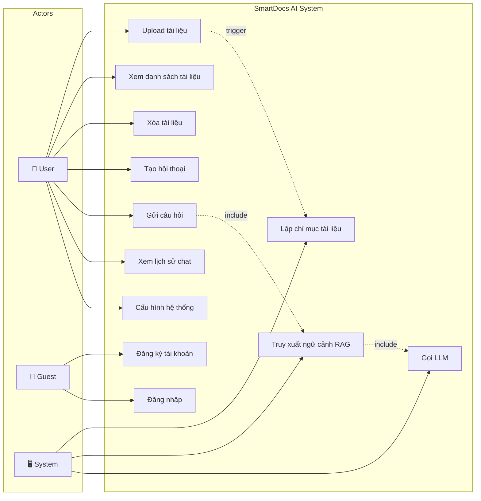
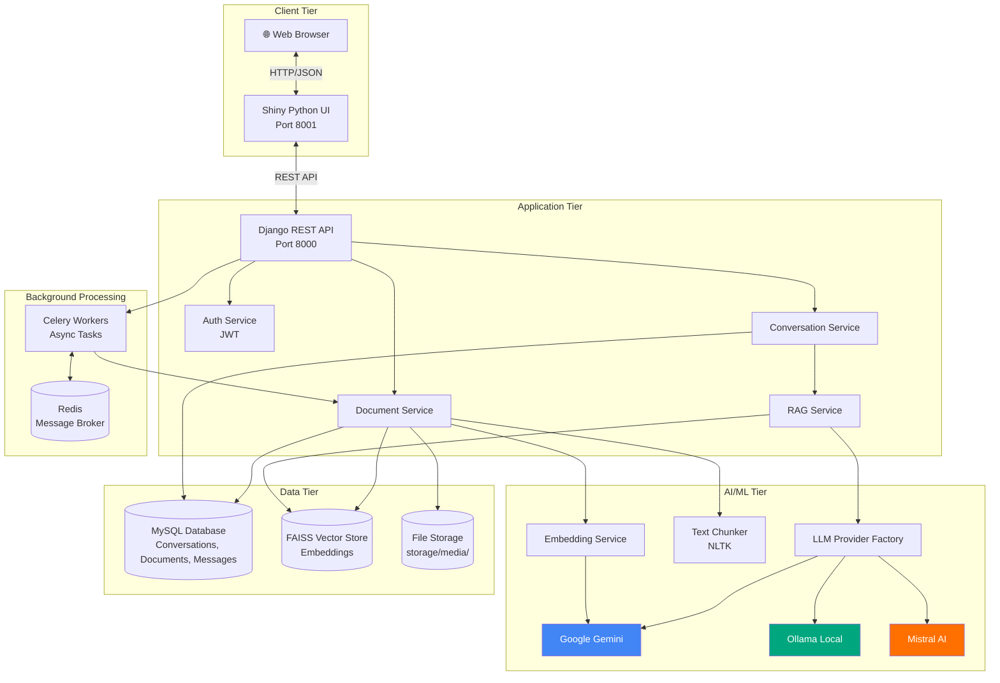
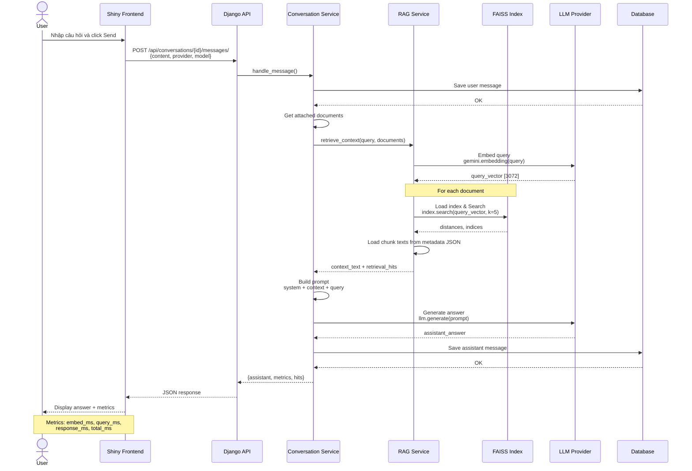
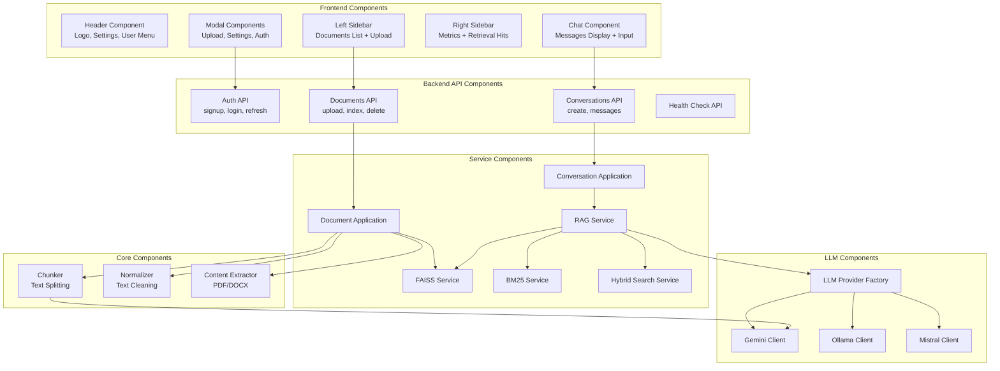
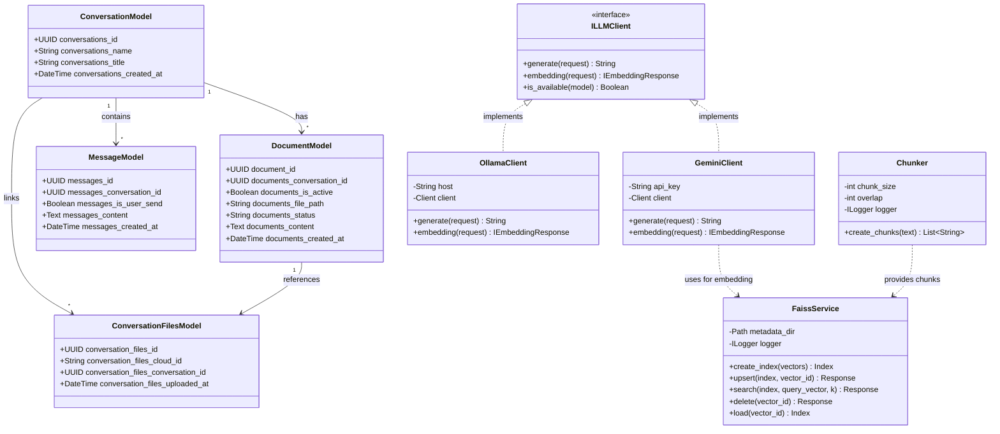

# BÁO CÁO PHÂN TÍCH DỰ ÁN SMARTDOCS (Phần 2)

## PHẦN 11. PHÂN TÍCH BẢO MẬT, LỖI VÀ GIỚI HẠN

### 11.1. Bảng phân tích bảo mật

| Vấn đề | Hiện trạng trong code | File liên quan | Đánh giá | Gợi ý cải thiện |
|--------|----------------------|----------------|----------|-----------------|
| **Kiểm tra định dạng file** | ✅ Có kiểm tra extension (.pdf, .docx) | `documents/views.py` | Tốt | Thêm magic number validation |
| **Giới hạn dung lượng file** | ❌ Không tìm thấy | - | Cần cải thiện | Thêm MAX_FILE_SIZE check |
| **Xử lý file độc hại** | ❌ Không có scanning | - | Nguy hiểm | Tích hợp ClamAV hoặc VirusTotal |
| **Che API key** | ✅ Sử dụng .env | `.env.example` | Tốt | Đảm bảo .env không commit |
| **Xử lý LLM API fail** | ✅ Try-catch với mock fallback | `conversations/views.py` | Tốt | Log errors chi tiết hơn |
| **Xử lý tài liệu rỗng** | ✅ Kiểm tra `if not extracted_text.strip()` | `documents/views.py` | Tốt | - |
| **Logging** | ✅ Có custom logger | `sys_services/logging.py` | Tốt | Thêm log rotation |
| **Validate input người dùng** | ⚠️ Basic validation | `auth/views.py` | Trung bình | Thêm email format check, password strength |
| **Bảo vệ dữ liệu cá nhân** | ❌ Không encrypt DB | - | Cần cải thiện | Encrypt sensitive fields |
| **Authentication** | ✅ JWT-based | `auth/views.py` | Tốt | Thêm refresh token rotation |
| **Authorization** | ❌ Không có per-user isolation | - | Nguy hiểm | Thêm user ownership checks |
| **CSRF Protection** | ⚠️ Disabled (REST API) | `settings/local.py` | Trung bình | OK cho REST API với JWT |
| **SQL Injection** | ✅ Django ORM tự động escape | Django ORM | An toàn | - |
| **XSS Protection** | ⚠️ Frontend render markdown | `frontend/app.py` | Cần kiểm tra | Sanitize markdown output |
| **Rate Limiting** | ❌ Không có | - | Cần cải thiện | Thêm Django rate limit middleware |

### 11.2. Xử lý lỗi

**Các điểm xử lý lỗi tốt:**

1. **LLM API Failures:**
```python
# conversations/views.py
try:
    answer = llm_provider.generate(prompt)
except Exception as exc:
    answer = "Error: Could not connect to LLM. Here is the context..."
    used_mock = True
```

2. **FAISS Retrieval Fallback:**
```python
try:
    # FAISS search
    ...
except Exception:
    # Fallback to keyword search
    ...
```

3. **Document Not Found:**
```python
try:
    doc = DocumentModel.objects.get(pk=document_id)
except DocumentModel.DoesNotExist:
    return Response({"error": "Document not found"}, status=404)
```

**Các điểm cần cải thiện:**

1. **Không kiểm tra user ownership:**
```python
# HIỆN TẠI: Bất kỳ user nào cũng có thể xóa document của người khác
def delete(self, request, document_id):
    doc = DocumentModel.objects.get(pk=document_id)
    doc.delete()  # ← Không kiểm tra user

# NÊN LÀM:
def delete(self, request, document_id):
    doc = DocumentModel.objects.get(pk=document_id, user=request.user)
    # ← Chỉ cho phép xóa document của chính mình
```

2. **Không giới hạn số lượng documents:**
- User có thể upload vô hạn documents → Tốn storage

3. **Không timeout cho embedding:**
- Nếu document quá lớn → embedding timeout → Celery task bị stuck


### 11.3. Giới hạn của hệ thống

| Giới hạn | Mô tả | Ảnh hưởng |
|----------|-------|-----------|
| **Không hỗ trợ OCR** | Chỉ đọc được PDF text-based | Không đọc được PDF scan, ảnh |
| **Không hỗ trợ nhiều ngôn ngữ embedding** | Chỉ optimize cho tiếng Anh | Accuracy thấp với tiếng Việt |
| **FAISS index không persistent** | Index lưu trên filesystem | Mất index nếu server crash |
| **Không có user isolation** | Tất cả documents dùng chung | Privacy issue |
| **Single embedding model** | Chỉ dùng Gemini embedding | Vendor lock-in |
| **Không có caching** | Mỗi query đều search lại | Chậm với query lặp lại |
| **Context window limit** | LLM có giới hạn context | Không trả lời được câu hỏi phức tạp cần nhiều context |

---

## PHẦN 12. CÀI ĐẶT, CHẠY THỬ VÀ TRIỂN KHAI

### 12.1. Hướng dẫn cài đặt

#### Bước 1: Tạo môi trường ảo

```bash
# Windows
python -m venv .venv
.venv\Scripts\activate

# Linux/Mac
python3 -m venv .venv
source .venv/bin/activate
```

#### Bước 2: Cài đặt dependencies

```bash
# Backend
pip install -r backend/requirements/dev.txt

# Frontend
pip install -r frontend/requirements/dev.txt
```

**Lưu ý:** Cần cài đặt FAISS riêng:
```bash
# CPU version (đơn giản)
pip install faiss-cpu

# GPU version (cần CUDA)
# Xem hướng dẫn: https://faiss.ai/index.html
conda install -c pytorch faiss-gpu
```

#### Bước 3: Tạo file .env

```bash
# Copy template
cp .env.example .env

# Chỉnh sửa .env với API keys thực
```

**Các biến môi trường BẮT BUỘC:**
- `SECRET_KEY`: Django secret key
- `GEMINI_API_KEY`: Google Gemini API key (để embedding + generation)
- `DB_*`: Database credentials (nếu dùng MySQL)

**Các biến môi trường TÙY CHỌN:**
- `MISTRAL_API_KEY`: Nếu dùng Mistral
- `OLLAMA_BASE_URL`: Nếu dùng Ollama local
- `QDRANT_*`: Nếu dùng Qdrant thay FAISS

#### Bước 4: Migrate database

```bash
python manage.py migrate
```

#### Bước 5: Tạo thư mục metadata

```bash
mkdir -p backend/metadata/faiss
mkdir -p backend/metadata/docs
mkdir -p storage/media
```

### 12.2. Chạy Development

#### Terminal 1: Backend API
```bash
python manage.py runserver
# Hoặc:
# python -m uvicorn app.asgi:application --host 0.0.0.0 --port 8000 --reload
```

#### Terminal 2: Frontend
```bash
shiny run --app-dir frontend --reload
```

#### Terminal 3 (Optional): Celery Worker
```bash
celery -A backend.apps.tasks worker --loglevel=info
```

#### Terminal 4 (Optional): Celery Beat
```bash
celery -A backend.apps.tasks beat --loglevel=info
```

**Truy cập:**
- Frontend: http://localhost:8001
- Backend API: http://localhost:8000
- API Docs: http://localhost:8000/api/ (nếu có browsable API)

### 12.3. Chạy Production với Docker

```bash
# Build và start tất cả services
docker compose -f docker-compose.yml --env-file .env up --build

# Chạy background
docker compose up -d

# Xem logs
docker compose logs -f backend

# Stop
docker compose down
```

**Services được start:**
- `backend`: Django API (port 8000)
- `frontend`: Shiny UI (port 8001)
- `redis`: Message broker (port 6379)
- `celery`: Background worker
- `celery-beat`: Scheduler

### 12.4. Chạy Tests

```bash
# Backend tests
pytest backend/

# Frontend tests (nếu có)
pytest frontend/

# Specific test file
python -m pytest backend/tests/test_documents.py
```

**Lưu ý:** File test hiện tại trong `tests/` có thể cần cập nhật paths.

---

## PHẦN 13. KẾT QUẢ THỰC NGHIỆM / ĐÁNH GIÁ

### 13.1. Dữ liệu test

**Chưa tìm thấy:**
- File test data mẫu
- Kịch bản test chi tiết
- Output/screenshot mẫu

**Có sẵn:**
- `docs/` folder (có thể chứa test PDFs)
- `.gitignore` exclude `docs/pdfs_test/`, `tests/output/`

### 13.2. Kịch bản thử nghiệm đề xuất

#### Test Case 1: Upload và Index PDF văn bản

**Mục đích:** Kiểm tra khả năng xử lý file PDF text-based

**Các bước:**
1. Upload file PDF (5-10 trang, ~2MB)
2. Click "Index" button
3. Chờ status chuyển từ "uploaded" → "processing" → "indexed"
4. Kiểm tra thời gian xử lý

**Kết quả mong đợi:**
- Status: "indexed"
- Chunks: 20-50 chunks
- Thời gian: 5-15s (tùy file size)

**Tiêu chí đánh giá:**
- ✅ Success: Status = "indexed", chunks > 0
- ❌ Fail: Status = "failed", error message

#### Test Case 2: Hỏi đáp theo tài liệu

**Mục đích:** Kiểm tra độ chính xác của RAG retrieval

**Các bước:**
1. Chọn document đã index
2. Đặt câu hỏi: "Tóm tắt nội dung chính của tài liệu"
3. Đợi response
4. Đánh giá câu trả lời

**Kết quả mong đợi:**
- Response time: 1-5s
- Answer: Chính xác, dựa trên nội dung tài liệu
- Metrics: Provider, model, timing được hiển thị

**Tiêu chí đánh giá:**
- **Độ chính xác:** Answer có đúng với nội dung tài liệu không?
- **Độ đầy đủ:** Answer có đủ thông tin không?
- **Không hallucination:** Answer có bịa đặt thông tin không?

#### Test Case 3: Xử lý file không hỗ trợ

**Mục đích:** Kiểm tra error handling

**Các bước:**
1. Upload file .xlsx hoặc .ppt
2. Click "Index"

**Kết quả mong đợi:**
- Error message rõ ràng
- Status: "failed" hoặc không cho upload

#### Test Case 4: Multi-document query

**Mục đích:** Kiểm tra khả năng truy xuất từ nhiều documents

**Các bước:**
1. Upload 2-3 documents
2. Index tất cả
3. Select tất cả documents
4. Đặt câu hỏi liên quan đến nhiều documents

**Kết quả mong đợi:**
- Answer tổng hợp thông tin từ nhiều nguồn
- Retrieval hits hiển thị chunks từ các documents khác nhau

#### Test Case 5: So sánh providers

**Mục đích:** Đánh giá chất lượng các LLM providers

**Các bước:**
1. Cùng 1 câu hỏi
2. Test với Gemini, Ollama, Mistral
3. So sánh response quality và timing

**Tiêu chí đánh giá:**
- Response time
- Answer quality
- Cost (API calls)

### 13.3. Metrics đánh giá

| Metric | Cách đo | Giá trị mong đợi |
|--------|---------|------------------|
| **Upload time** | Time từ click upload → status "uploaded" | < 1s (small files) |
| **Indexing time** | Time từ click index → status "indexed" | 5-30s (tùy file) |
| **Embedding time** | `embed_ms` từ metrics | 200-500ms |
| **Search time** | `query_ms` từ metrics | 10-100ms |
| **LLM time** | `response_ms` từ metrics | 1-5s |
| **Total query time** | `total_ms` từ metrics | 1.5-6s |
| **Accuracy** | Manual evaluation | > 80% correct answers |
| **Retrieval relevance** | Check retrieval_hits | Top 3 chunks có liên quan |


### 13.4. Đánh giá tổng quan

**Điểm mạnh:**
- ✅ Kiến trúc rõ ràng, dễ bảo trì
- ✅ RAG pipeline chuẩn, hiệu quả
- ✅ Hỗ trợ nhiều LLM providers
- ✅ Error handling tốt với fallback
- ✅ Metrics chi tiết giúp debug
- ✅ Docker deployment sẵn sàng

**Điểm yếu:**
- ❌ Không có user isolation (bảo mật kém)
- ❌ Không hỗ trợ OCR cho PDF scan
- ❌ Không có caching (performance)
- ❌ Không có rate limiting (có thể bị abuse)
- ❌ Embedding model bị lock vào Gemini
- ❌ Chưa implement Circuit Breaker pattern (chỉ có try-catch đơn giản)
- ⚠️ Test coverage thấp

**Đề xuất cải thiện:**
1. Thêm user authentication vào tất cả endpoints
2. Implement Redis caching cho repeated queries
3. Thêm Mistral OCR cho PDF scan support
4. Implement rate limiting với Django middleware
5. Support multiple embedding providers
6. **Implement Circuit Breaker với tenacity library** (đã cài đặt nhưng chưa dùng)
7. Viết comprehensive tests

---

## PHẦN 14. SƠ ĐỒ CẦN TẠO CHO BÁO CÁO

### 14.1. Hình 3.1: Sơ đồ Use Case



**Mô tả:** Use case diagram thể hiện các chức năng chính mà user và system có thể thực hiện. Guest chỉ có thể đăng ký/đăng nhập, User đã authenticated có thể sử dụng đầy đủ chức năng.

### 14.2. Hình 3.2: Sơ đồ kiến trúc tổng thể



**Mô tả:** Kiến trúc 4 tầng (Client, Application, AI/ML, Data) với background processing. Minh họa luồng dữ liệu từ browser → frontend → backend API → services → data stores và AI providers.

### 14.3. Hình 3.3: Quy trình xử lý tài liệu (Document Processing Pipeline)

```mermaid
flowchart TD
    Start([User uploads document]) --> Upload[Upload file to storage]
    Upload --> SaveDB[Save DocumentModel<br/>status: uploaded]
    SaveDB --> TriggerIndex{User clicks<br/>Index?}
    
    TriggerIndex -->|Yes| Extract[Extract text<br/>PDF/DOCX/TXT]
    Extract --> Normalize[Normalize text<br/>Remove whitespace]
    Normalize --> Chunk[Chunk text<br/>NLTKTextSplitter<br/>size:1000, overlap:200]
    Chunk --> EmbedLoop{For each chunk}
    
    EmbedLoop -->|Next chunk| CallEmbed[Call Gemini Embedding API<br/>gemini-embedding-2]
    CallEmbed --> CollectEmbed[Collect embedding vector<br/>dimension: 3072]
    CollectEmbed --> EmbedLoop
    
    EmbedLoop -->|All done| BuildIndex[Build FAISS IndexFlatL2<br/>from all vectors]
    BuildIndex --> SaveFAISS[Save index to<br/>metadata/faiss/{uuid}.faiss]
    SaveFAISS --> SaveMeta[Save chunk metadata to<br/>metadata/docs/{uuid}.json]
    SaveMeta --> UpdateStatus[Update DocumentModel<br/>status: indexed]
    UpdateStatus --> End([Document ready for queries])
    
    TriggerIndex -->|No| Wait([Document uploaded<br/>but not indexed])
    
    Extract -.->|Error| HandleError[Set status: failed]
    CallEmbed -.->|Error| HandleError
    BuildIndex -.->|Error| HandleError
    HandleError --> ErrorEnd([Document failed])
    
    style Start fill:#4caf50,color:#fff
    style End fill:#2196f3,color:#fff
    style ErrorEnd fill:#f44336,color:#fff
    style CallEmbed fill:#ff9800,color:#fff
```

**Mô tả:** Flowchart chi tiết quy trình xử lý tài liệu từ upload → extract → normalize → chunk → embed → FAISS index. Bao gồm error handling.

### 14.4. Hình 3.4: Sequence Diagram - User Query Flow



**Mô tả:** Sequence diagram minh họa luồng xử lý từ khi user gửi câu hỏi đến khi nhận được câu trả lời, bao gồm RAG retrieval và LLM generation.

### 14.5. Hình 3.5: Component Diagram



**Mô tả:** Component diagram thể hiện các module chính và mối quan hệ phụ thuộc giữa chúng.


### 14.6. Hình 3.6: Class Diagram (Rút gọn)



**Mô tả:** Class diagram rút gọn thể hiện các model chính (Django ORM), interfaces và implementation của LLM clients, và services quan trọng.

---

## PHỤ LỤC

### A. Danh sách biến môi trường

| Biến | Mô tả | Giá trị mặc định | Bắt buộc |
|------|-------|------------------|----------|
| `SECRET_KEY` | Django secret key | - | ✅ |
| `DEBUG` | Debug mode | 0 | ❌ |
| `ALLOWED_HOSTS` | Django allowed hosts | localhost,127.0.0.1 | ❌ |
| `DB_ENGINE` | Database engine | django.db.backends.mysql | ❌ |
| `DB_HOST` | Database host | mysql | ❌ |
| `DB_PORT` | Database port | 3306 | ❌ |
| `DB_NAME` | Database name | py_smartdocs | ❌ |
| `DB_USER` | Database user | root | ❌ |
| `DB_PASSWORD` | Database password | - | ⚠️ (if using MySQL) |
| `GEMINI_API_KEY` | Google Gemini API key | - | ✅ |
| `GEMINI_MODEL` | Gemini model name | gemini-2.5-flash | ❌ |
| `EMBEDDING_MODEL_NAME` | Embedding model | gemini-embedding-2-preview | ❌ |
| `EMBEDDING_VECTOR_SIZE` | Embedding dimension | 3072 | ❌ |
| `MISTRAL_API_KEY` | Mistral AI API key | - | ⚠️ (if using Mistral) |
| `OLLAMA_BASE_URL` | Ollama API URL | http://ollama:11434 | ⚠️ (if using Ollama) |
| `OLLAMA_MODEL` | Ollama model name | qwen2.5:3b | ❌ |
| `CELERY_BROKER_URL` | Celery broker | redis://redis:6379/0 | ❌ |
| `CELERY_RESULT_BACKEND` | Celery result backend | redis://redis:6379/1 | ❌ |
| `QDRANT_URL` | Qdrant URL | http://qdrant:6333 | ⚠️ (experimental) |
| `CHUNK_SIZE` | Chunking size | 700 | ❌ |
| `CHUNK_OVERLAP` | Chunking overlap | 120 | ❌ |
| `RETRIEVAL_TOP_K` | RAG top-k results | 5 | ❌ |

### B. API Endpoints đầy đủ

**Base URL:** `http://localhost:8000`

#### Authentication
- `POST /api/auth/signup/` - Đăng ký
- `POST /api/auth/login/` - Đăng nhập
- `POST /api/auth/refresh/` - Refresh token
- `GET /api/auth/me/` - Thông tin user (requires auth)
- `POST /api/auth/logout/` - Đăng xuất

#### Documents
- `GET /api/documents/` - List documents
- `POST /api/documents/upload/` - Upload file
- `GET /api/documents/{id}/` - Document detail
- `DELETE /api/documents/{id}/` - Delete document
- `POST /api/documents/{id}/index/` - Index document
- `GET /api/documents/{id}/status/` - Document status

#### Conversations
- `GET /api/conversations/` - List conversations
- `POST /api/conversations/` - Create conversation
- `GET /api/conversations/{id}/` - Conversation detail
- `PATCH /api/conversations/{id}/documents/` - Update documents
- `GET /api/conversations/{id}/messages/` - List messages
- `POST /api/conversations/{id}/messages/` - Send message

#### Health
- `GET /api/health/` - Health check

### C. Thư viện Python đầy đủ

**Backend (backend/requirements/base.txt):**
```
Django==5.2.7
djangorestframework==3.16.1
django-cors-headers==4.9.0
django-filter==25.2
celery==5.5.3
redis[hiredis]==6.4.0
qdrant-client==1.15.1
langchain==0.3.27
langchain-qdrant==0.2.1
pypdf==5.4.0
httpx==0.28.1
python-dotenv==1.1.1
certifi==2026.5.20
pytz==2026.2
dependency-injector==4.49.0
orjson==3.11.9
loguru==0.7.3
tenacity==9.1.4
sentry-sdk==2.61.1
kombu==5.5.4
PyJWT==2.13.0
uvicorn==0.49.0
gunicorn==26.0.0
neo4j
neo4j-graphrag
mariadb
mistralai
NLTK
google-genai
ollama
rank-bm25
PyVi
faiss-cpu
```

**Frontend (frontend/requirements/dev.txt):**
```
shiny
httpx
python-dotenv
```

**Development (backend/requirements/dev.txt):**
```
-r base.txt
pytest==8.4.2
pytest-django==4.11.1
pytest-mock==3.15.1
```

### D. Command Cheat Sheet

```bash
# Development
python manage.py runserver                    # Backend
shiny run --app-dir frontend --reload          # Frontend
celery -A backend.apps.tasks worker -l info   # Celery worker
celery -A backend.apps.tasks beat -l info     # Celery beat

# Django management
python manage.py migrate                       # Run migrations
python manage.py makemigrations               # Create migrations
python manage.py createsuperuser              # Create admin user
python manage.py shell                        # Django shell

# Docker
docker compose up -d                          # Start all services
docker compose down                           # Stop all services
docker compose logs -f backend                # View backend logs
docker compose ps                             # List services
docker compose exec backend python manage.py shell  # Django shell in container

# Testing
pytest backend/                               # Run all backend tests
pytest -v                                     # Verbose output
pytest -k test_upload                         # Run specific test

# Debugging
python -m pdb manage.py runserver             # Debug mode
celery -A backend.apps.tasks inspect active   # Check active tasks
redis-cli                                     # Redis CLI
```

### E. Tài liệu tham khảo

1. **Django Documentation:** https://docs.djangoproject.com/
2. **Django REST Framework:** https://www.django-rest-framework.org/
3. **Shiny for Python:** https://shiny.posit.co/py/
4. **FAISS Documentation:** https://faiss.ai/
5. **LangChain Python:** https://python.langchain.com/
6. **Google Gemini API:** https://ai.google.dev/
7. **Ollama:** https://ollama.ai/
8. **Celery Documentation:** https://docs.celeryproject.org/

---

## KẾT LUẬN

### Tổng kết

Dự án **SmartDocs AI** là một hệ thống RAG (Retrieval-Augmented Generation) hoàn chỉnh, được xây dựng trên nền tảng Python với Django backend và Shiny frontend. Hệ thống cho phép người dùng upload tài liệu PDF/DOCX, tự động xử lý và lập chỉ mục bằng FAISS vector database, sau đó trả lời câu hỏi dựa trên nội dung tài liệu sử dụng các mô hình ngôn ngữ lớn (LLM).

**Công nghệ chính:**
- **Backend:** Django 5.2.7, Django REST Framework
- **Frontend:** Shiny for Python
- **AI/ML:** Google Gemini, Ollama, Mistral AI
- **Vector DB:** FAISS (file-based)
- **Background Processing:** Celery + Redis
- **Deployment:** Docker Compose

**Kiến trúc:** Client-Server với REST API, phân tầng rõ ràng (Presentation, API, Service, Data), hỗ trợ async processing với Celery.

**Chức năng chính:**
1. Authentication (JWT-based)
2. Document management (upload, index, delete)
3. RAG retrieval (FAISS vector search)
4. Multi-provider LLM support
5. Conversation management
6. Real-time metrics tracking

**Ưu điểm:**
- Kiến trúc clean, dễ mở rộng
- RAG pipeline chuẩn, hiệu quả
- Error handling tốt với fallback
- Docker-ready cho production

**Hạn chế:**
- Thiếu user isolation (security concern)
- Không hỗ trợ OCR
- Không có caching
- Test coverage thấp

Dự án phù hợp làm đồ án tốt nghiệp ngành CNTT, thể hiện được kiến thức về:
- Web development (Django, REST API)
- AI/ML (LLM, embeddings, RAG)
- Database design
- System architecture
- DevOps (Docker, deployment)

---

**Người phân tích:** Kiro AI Assistant  
**Ngày hoàn thành:** 20/06/2026  
**File output:**
- `BAO_CAO_PHAN_TICH_DU_AN_SMARTDOCS.md` (Phần 1-10)
- `BAO_CAO_PHAN_TICH_PHAN_2.md` (Phần 11-14 + Phụ lục)

---

**LƯU Ý QUAN TRỌNG KHI VIẾT BÁO CÁO:**

1. **Tất cả thông tin trong báo cáo này đều dựa trên phân tích mã nguồn thực tế**
2. **Có ghi rõ file nguồn và đường dẫn cho mỗi thông tin**
3. **Sơ đồ Mermaid có thể copy trực tiếp vào báo cáo**
4. **Cần chạy thử hệ thống để chụp screenshot thực tế**
5. **Nên bổ sung test cases với data thực và ghi kết quả**
6. **Các biến môi trường nhạy cảm (API keys) không được công khai**
7. **Nên thêm phần "Hướng phát triển tương lai" vào báo cáo**

Chúc bạn viết báo cáo thành công! 🎓
