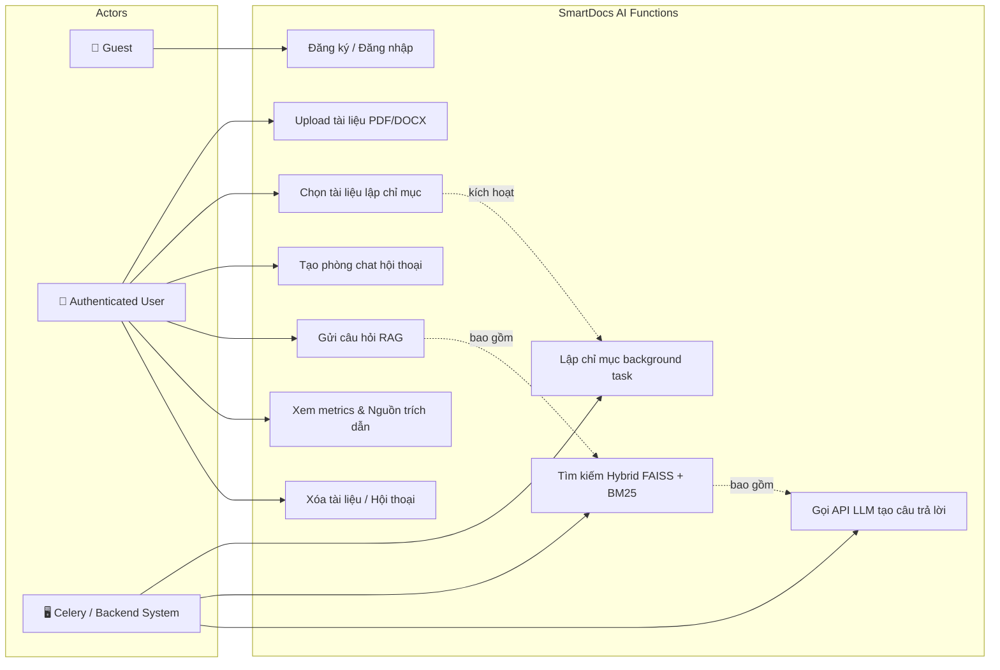
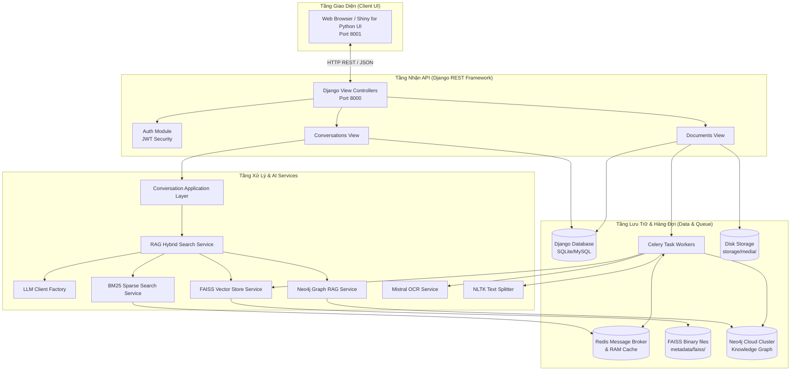
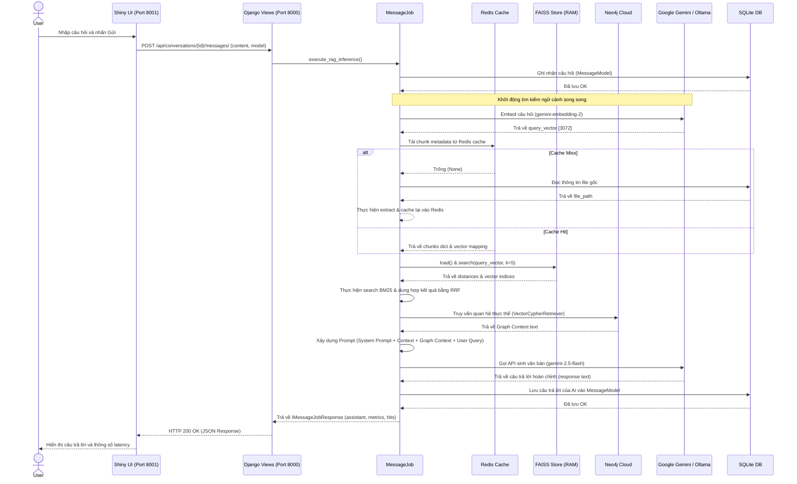

# BÁO CÁO PHÂN TÍCH TOÀN DIỆN DỰ ÁN SMARTDOCS AI

**Ngày cập nhật:** 22/06/2026  
**Phạm vi:** Tài liệu phân tích kỹ thuật chi tiết dành cho lập trình viên, nghiên cứu viên và người đọc muốn nắm bắt toàn bộ dự án từ tổng quan đến chi tiết mã nguồn.

---

## MỤC LỤC

1. [TẤT CẢ CÁC LUỒNG CỦA PROJECT (PROJECT FLOWS)](#1-tất-cả-các-luồng-của-project-project-flows)
2. [CÔNG NGHỆ VÀ THUẬT TOÁN SỬ DỤNG](#2-công-nghệ-và-thuật-toán-sử-dụng)
3. [KIẾN TRÚC CONTAINER IoC & DEPENDENCY INJECTION (DI)](#3-kiến-trúc-container-ioc--dependency-injection-di)
4. [CÁCH THỨC HOẠT ĐỘNG CỦA CÁC HÀM QUAN TRỌNG VÀ TRÌNH TỰ SỬ DỤNG](#4-cách-thức-hoạt-động-của-các-hàm-quan-trọng-và-trình-tự-sử-dụng)
5. [CƠ CHẾ TỐI ƯU HIỆU NĂNG HỆ THỐNG (MEMORY POOL & LOG POOL)](#5-cơ-chế-tối-ưu-hiệu-năng-hệ-thống-memory-pool--log-pool)
6. [CÁC BIẾN QUAN TRỌNG VÀ Ý NGHĨA](#6-các-biến-quan-trọng-và-ý-nghĩa)
7. [DỮ LIỆU TRẢ VỀ CỦA TỪNG ENDPOINT KHI ĐƯỢC GỌI](#7-dữ-liệu-trả-về-của-từng-endpoint-khi-được-gọi)
8. [SƠ ĐỒ HỆ THỐNG (MERMAID DIAGRAMS)](#8-sơ-đồ-hệ-thống-mermaid-diagrams)
9. [NHỮNG ĐIỂM QUAN TRỌNG KHÁC CẦN LƯU Ý](#9-những-điểm-quan-trọng-khác-cần-lưu-y)

---

## 1. TẤT CẢ CÁC LUỒNG CỦA PROJECT (PROJECT FLOWS)

Dự án **SmartDocs AI** vận hành theo kiến trúc client-server (Frontend viết bằng Shiny for Python, Backend viết bằng Django REST Framework). Dưới đây là 3 luồng nghiệp vụ cốt lõi của hệ thống:

### 1.1. Luồng Lập Chỉ Mục Tài Liệu (Document Indexing Pipeline)
Được kích hoạt khi người dùng tải tài liệu lên và chọn "Index". Tiến trình này diễn ra bất đồng bộ thông qua Celery Worker để tránh tắc nghẽn server:

```
[User Uploads PDF/DOCX] 
      │
      ▼
[Save File to Disk] ──► Lưu file gốc vào thư mục storage/media/ và tạo bản ghi ở trạng thái "uploaded"
      │
      ▼
[Upload to Mistral Cloud] ──► Gọi API Mistral qua ILLMUploader để lấy cloud file_id (chỉ Mistral mới hỗ trợ upload)
      │
      ▼
[Mistral OCR Extract] ──► Trích xuất văn bản (hỗ trợ cả tài liệu scan, hình ảnh) thông qua Mistral OCR API
      │
      ▼
[Text Normalization] ──► Chuẩn hóa văn bản bằng regex (loại bỏ khoảng trắng dư thừa, định dạng dòng trống)
      │
      ▼
[Text Chunking] ──► Phân đoạn văn bản bằng NLTKTextSplitter (mặc định chunk_size = 1000 - 2000 ký tự, overlap = 200)
      │
      ▼
[Vector Embedding] ──► Chuyển đổi từng chunk văn bản thành vector embeddings 3072 chiều (Gemini Embedding API)
      │
      ▼
[Write to Redis Cache] ──► Lưu cache thông tin chunk (id, text_value, embedding vector) vào Redis theo Key = file_id
      │
      ▼
[Build & Save FAISS Index] ──► Tạo index IndexFlatL2, add vectors, ghi file .faiss vào metadata/faiss/{uuid}.faiss
      │
      ▼
[Write Chunk Metadata] ──► Ghi tệp JSON lưu trữ mapping chunk_id -> chunk_text vào metadata/docs/{uuid}.json
      │
      ▼
[Update DB Status] ──► Cập nhật trạng thái DocumentModel.status thành "indexed"
```

### 1.2. Luồng Xử Lý Câu Hỏi Người Dùng (RAG Query Flow)
Luồng này thực thi đồng bộ khi người dùng đặt câu hỏi trong phòng chat. Quy trình kết hợp tìm kiếm ngữ nghĩa (Semantic Search), tìm kiếm từ khóa (Keyword Search) và Đồ thị tri thức (Graph RAG):

```
[User Query Input]
      │
      ▼
[Save to DB] ──► Ghi nhận tin nhắn của User vào MessageModel
      │
      ▼
[Query Embedding] ──► Chuyển đổi câu hỏi thành vector biểu diễn bằng API Gemini Embedding
      │
      ▼
[Parallel Document Retrieval]
   ├── 1. Dense Semantic Search: Dùng FAISS so khớp L2 Distance trên các index tài liệu đang chọn
   ├── 2. Sparse Keyword Search: Dùng BM25 tìm các phân đoạn khớp từ khóa thô
   └── 3. Graph RAG (Neo4j): Truy vấn thực thể và quan hệ thông qua VectorCypherRetriever trên Neo4j Cloud Cluster
      │
      ▼
[Hybrid Search Fusion (RRF)] ──► Dung hợp kết quả FAISS & BM25 bằng thuật toán Reciprocal Rank Fusion (RRF)
      │
      ▼
[Context Reconstruction] ──► Lấy top 5 chunk văn bản tốt nhất sau fusion + kết hợp dữ liệu quan hệ từ Neo4j
      │
      ▼
[Prompt Construction] ──► Gộp System Prompt, Ngữ cảnh tài liệu (Context), Ngữ cảnh Đồ thị (Graph Context) và Câu hỏi
      │
      ▼
[LLM Generation Request] ──► Gửi Prompt tới mô hình LLM (Gemini Flash/Pro hoặc Ollama Qwen)
      │
      ▼
[Response Fallback Handling] ──► Nếu API LLM lỗi, fallback tự động trả về simulated response chứa đoạn ngữ cảnh thô
      │
      ▼
[Save & Return] ──► Lưu câu trả lời vào MessageModel, trả về dữ liệu cho FE hiển thị kèm các metrics đo đạc tốc độ
```

### 1.3. Luồng Xác Thực Phiên Làm Việc (Authentication Flow)
Hệ thống sử dụng cơ chế JWT (JSON Web Token) để quản lý bảo mật API:
1. **Đăng ký (Signup):** Nhận email, password, name -> Tạo tài khoản -> Trả về Access Token (1 giờ) & Refresh Token (7 ngày).
2. **Đăng nhập (Login):** Xác thực thông tin -> Trả về cặp tokens.
3. **Lấy Token mới (Refresh):** FE gửi Refresh Token lên endpoint `/api/auth/refresh/` để nhận Access Token mới khi token cũ hết hạn.
4. **Đăng xuất (Logout):** Xóa tokens ở phía Client (FE).

---

## 2. CÔNG NGHỆ VÀ THUẬT TOÁN SỬ DỤNG

### 2.1. Danh Sách Công Nghệ

| Công nghệ / Thư viện | Tác dụng trong dự án | File tiêu biểu sử dụng |
| :--- | :--- | :--- |
| **Django (5.2.7) & DRF (3.16.1)** | Xây dựng khung API backend, ORM tương tác database, quản lý Middleware, định tuyến URL | [settings/local.py](file:///c:/py_smartdocs/app/settings/local.py), [views.py](file:///c:/py_smartdocs/backend/api/conversations/views.py) |
| **Shiny for Python** | Framework xây dựng giao diện người dùng (UI) reactive phía Client, giao tiếp REST API | [app.py](file:///c:/py_smartdocs/frontend/app.py) |
| **FAISS (faiss-cpu)** | Thư viện Vector Database chạy trên RAM giúp lập chỉ mục và tìm kiếm ngữ nghĩa siêu nhanh | [faiss_service.py](file:///c:/py_smartdocs/backend/apps/services/rag_base/locate/faiss_service.py) |
| **Rank-BM25** | Thực hiện tìm kiếm từ khóa thô (Sparse Vector Search) làm phương án bổ trợ | [bm25_service.py](file:///c:/py_smartdocs/backend/apps/services/rag_base/locate/bm25_service.py) |
| **Neo4j Graph RAG** | Quản lý, trích xuất và truy vấn dữ liệu đồ thị tri thức (thực thể & mối quan hệ) | [neo4j_service.py](file:///c:/py_smartdocs/backend/apps/services/rag_base/locate/neo4j/neo4j_service.py) |
| **Redis** | Làm Message Broker cho Celery và làm RAM Cache lưu trữ các phân đoạn chunk kèm vector embedding | [radis_cache_service.py](file:///c:/py_smartdocs/backend/apps/services/cache/radis_cache_service.py) |
| **Celery** | Quản lý và thực thi các hàng đợi công việc nền (background jobs) như xử lý và index file | [upload_tasks.py](file:///c:/py_smartdocs/backend/apps/tasks/upload_tasks.py) |
| **Mistral AI SDK** | Trích xuất văn bản từ tài liệu scan bằng Mistral OCR API (`mistral-ocr-latest`) | [mistral_ocr.py](file:///c:/py_smartdocs/backend/apps/llm/llm_ocr/mistral_ocr.py) |
| **Google GenAI SDK** | Gọi các model Gemini (`gemini-2.5-flash`, `gemini-pro`) và model tạo embedding (`gemini-embedding-2`) | [gemini.py](file:///c:/py_smartdocs/backend/apps/llm/gemini.py) |
| **Ollama Client** | Giao tiếp với các LLM chạy local (như `qwen2.5:1.5b-instruct` hoặc `qwen2.5:3b`) để đảm bảo tính riêng tư | [ollama.py](file:///c:/py_smartdocs/backend/apps/llm/ollama.py) |
| **LangChain (0.3.27)** | Sử dụng bộ chia nhỏ văn bản `NLTKTextSplitter` để chia tài liệu theo câu thông minh | [chunker.py](file:///c:/py_smartdocs/backend/apps/core/chunk/chunker.py) |
| **PyJWT** | Mã hóa và giải mã JSON Web Tokens phục vụ xác thực người dùng | [auth/views.py](file:///c:/py_smartdocs/backend/api/auth/views.py) |

### 2.2. Thuật Toán Cốt Lõi

#### 2.2.1. Phân Đoạn Văn Bản (NLTK Text Splitting)
*   **Tác dụng:** Cắt nhỏ văn bản thành các chunk kích thước đều nhau nhưng không làm đứt đoạn câu giữa chừng.
*   **Hoạt động:** Sử dụng bộ token hóa câu của thư viện `NLTK` để phát hiện ranh giới câu. Tiến hành gom các câu lại sao cho tổng độ dài đạt mức cấu hình (ví dụ: 1000 - 2000 ký tự) và giữ lại một khoảng chồng lấp (overlap: 120 - 200 ký tự) với đoạn kế tiếp nhằm duy trì ngữ cảnh.
*   **Mã triển khai:** [chunker.py](file:///c:/py_smartdocs/backend/apps/core/chunk/chunker.py)

#### 2.2.2. Tìm Kiếm Lân Cận L2 (Euclidean Distance Flat Index)
*   **Tác dụng:** Đo độ tương đồng ngữ nghĩa giữa vector câu hỏi và vector các chunk tài liệu.
*   **Hoạt động:** Sử dụng `faiss.IndexFlatL2`. Thuật toán thực hiện tính toán khoảng cách Euclidean (L2) giữa vector truy vấn $q$ và tất cả vector chunk $v_i$ trong không gian 3072 chiều:
    $$d(q, v_i) = \sqrt{\sum_{j=1}^{d} (q_j - v_{ij})^2}$$
    Khoảng cách càng nhỏ biểu thị mức độ tương đồng ngữ nghĩa càng cao.
*   **Mã triển khai:** [faiss_service.py](file:///c:/py_smartdocs/backend/apps/services/rag_base/locate/faiss_service.py)

#### 2.2.3. Thuật Toán Dung Hợp Kết Quả RRF (Reciprocal Rank Fusion)
*   **Tác dụng:** Kết hợp bảng xếp hạng kết quả từ 2 phương pháp tìm kiếm khác nhau (FAISS - tìm kiếm ngữ nghĩa và BM25 - tìm kiếm từ khóa thô) để đưa ra top kết quả tối ưu nhất.
*   **Hoạt động:** Với mỗi chunk văn bản $d$ xuất hiện trong danh sách kết quả của FAISS và BM25, điểm RRF được tính bằng tổng nghịch đảo của thứ hạng (rank) của nó trong từng danh sách cộng thêm hằng số làm mịn $k$ (mặc định $k=60$):
    $$RRF\_Score(d) = \sum_{m \in \{Dense, Sparse\}} \frac{1}{k + Rank_m(d)}$$
    Sau đó, hệ thống sắp xếp lại tất cả các chunk theo điểm số RRF giảm dần và chọn ra Top 5 chunk đưa vào prompt gửi LLM.
*   **Mã triển khai:** [hybrid_search_service.py](file:///c:/py_smartdocs/backend/apps/services/rag_base/search/hybrid_search_service.py)

#### 2.2.4. Mã Hóa ID Chunk và Giải Mã Ngược (Chunk ID Hashing & Resolution)
*   **Tác dụng:** FAISS chỉ chấp nhận ID vector ở dạng số nguyên 64-bit (`int64`), trong khi chunk ID thực tế ở dạng chuỗi `"document_id:chunk_index"`. Dự án cần một thuật toán mã hóa 1 chiều và khôi phục tương đối để mapping dữ liệu.
*   **Cách thức:**
    1. **Mã hóa lúc Upload:** Với chuỗi `"document_id:chunk_index"`, hệ thống băm bằng thuật toán SHA256, lấy 8 bytes đầu tiên và convert sang số nguyên `int64` có dấu để làm ID đưa vào FAISS.
    2. **Giải mã lúc Query:** Để truy xuất raw text từ ID số nguyên mà FAISS trả về, hệ thống thực hiện phép tính tuyến tính dựa trên hash của `document_id`:
       $$\text{base\_id} = \text{int.from\_bytes}(\text{sha256}(\text{document\_id})[:8]) \ \& \ \text{0x7FFFFFFFFFFFFFFF}$$
       $$\text{chunk\_index} = \text{vector\_id} - \text{base\_id} - 1$$
       Từ đó xây dựng lại key `"document_id:chunk_index"` để tìm raw text trong file JSON metadata.
*   **Mã triển khai:** [upload_job.py](file:///c:/py_smartdocs/backend/apps/job/upload_job.py#L321-L348) và [message_job.py](file:///c:/py_smartdocs/backend/apps/job/message_job.py#L164-L171)

---

## 3. KIẾN TRÚC CONTAINER IoC & DEPENDENCY INJECTION (DI)

Dự án áp dụng nguyên lý thiết kế hệ thống chuyên nghiệp **Dependency Inversion** và kiến trúc **Inversion of Control (IoC)** để quản lý vòng đời của tất cả các component, dịch vụ, LLM client và các background jobs.

### 3.1. Class `BackendContainer` (Container Khai Báo)
Dự án sử dụng thư viện `dependency-injector` làm IoC Container trung tâm để đăng ký dịch vụ dưới dạng các provider `Singleton` (tồn tại một phiên bản duy nhất trong suốt vòng đời app) hoặc `Factory` (sinh mới instance mỗi lần gọi).

*   **Vị trí file:** [container.py](file:///c:/py_smartdocs/backend/apps/config/container.py)
*   **Cách thức khai báo dependencies:**
    *   **Dịch vụ cấu hình & Tiện ích:** `config_provider` (Singleton của `EnvConfigProvider`), `logger` (Singleton của `Logger`).
    *   **Module xử lý văn bản:** `normalize` (Singleton), `chunker` (Singleton).
    *   **LLM Providers:** `llm_provider_factory` (Singleton quản lý cấu hình các client Gemini, Mistral, Ollama).
    *   **Database & Memory Pool:** `database_provider` (Singleton DB) và `faiss_memory_pool` (Singleton quản lý cache vector index).
    *   **Jobs (Nghiệp vụ cốt lõi):** `upload_job`, `delete_job`, `message_job`, `conversation_job` được đăng ký dưới dạng `providers.Factory`, tự động tiêm (inject) các dependencies tương ứng như dịch vụ trích xuất, chuẩn hóa, phân đoạn, cache session và Neo4j service.

### 3.2. Quản Lý Vòng Đời Component
Bằng cách quản lý qua DI Container, việc thay đổi một backend service (ví dụ: chuyển từ FAISS sang Qdrant hoặc nâng cấp module OCR) chỉ cần thực hiện khai báo lại trong file [container.py](file:///c:/py_smartdocs/backend/apps/config/container.py), hoàn toàn không làm ảnh hưởng đến mã nguồn sử dụng dịch vụ tại lớp API hoặc Lớp Task.

---

## 4. CÁCH THỨC HOẠT ĐỘNG CỦA CÁC HÀM QUAN TRỌNG VÀ TRÌNH TỰ SỬ DỤNG

### 4.1. Các Hàm Quan Trọng Trong Tiến Trình Index Tài Liệu (Upload & Index)

Tiến trình xử lý tài liệu nằm trong class `UploadJob` thuộc [upload_job.py](file:///c:/py_smartdocs/backend/apps/job/upload_job.py):

#### 1. `step_extract_and_normalize(file_path, provider)`
*   **Hoạt động:** Gọi `step_extract` để đọc nội dung file PDF/DOCX (thực tế gọi Mistral OCR API để quét ký tự hình ảnh/văn bản). Kết quả được đưa qua `step_normalize` để lọc bỏ các khoảng trắng và ký tự ngắt dòng thừa thãi bằng Regex.
*   **Trả về:** `IExtractResponse` chứa văn bản đã làm sạch.

#### 2. `step_chunk(document_id, normalized_text)`
*   **Hoạt động:** Gọi `self.chunker.create_chunks` để phân nhỏ văn bản. Sau đó gọi `build_chunk_keys` sinh ra các cặp key dạng `(hash_int64, string_key)` tương ứng với từng chunk.
*   **Trả về:** `IChunkResponse` chứa danh sách ID hash và raw text của các chunk.

#### 3. `step_embed(chunk_response, provider)`
*   **Hoạt động:** Duyệt qua danh sách chunk văn bản, gọi hàm embedding của LLM client (sử dụng Gemini API) để chuyển đổi mỗi chunk thành một numpy array float32 kích thước 3072 chiều.
*   **Trả về:** `IEmbedResponse` chứa mảng các vector embedding.

#### 4. `step_cache(chunk_response, embedding_response)`
*   **Hoạt động:** Kết nối với Redis thông qua `cache_session`. Đóng gói chunk text và vector embedding vào list các `ICacheParamValue`, lưu vào Redis với Key là `document_id`. Điều này giúp việc truy xuất sau này diễn ra trực tiếp trên RAM thay vì đọc ổ đĩa.

#### 5. `step_save(provider, faiss_file_id, document_ids, embedding_batches, chunk_texts, paths, ids)`
*   **Hoạt động:** Gom tất cả các list embeddings thành một ma trận vector (`np.vstack`). Khởi tạo index FAISS bằng `faiss.IndexFlatL2`, nạp ma trận vector và ghi tệp nhị phân `.faiss` xuống thư mục `metadata/faiss/{uuid}.faiss`. Đồng thời, lưu ánh xạ chunk ID thô và text tương ứng vào file JSON metadata `metadata/docs/{uuid}.json`.

---

### 4.2. Các Hàm Quan Trọng Trong Tiến Trình Gửi Tin Nhắn (Query & Chat)

Tiến trình xử lý câu hỏi nằm trong class `MessageJob` thuộc [message_job.py](file:///c:/py_smartdocs/backend/apps/job/message_job.py):

#### 1. `run(conversation_id, content, provider, model_name)`
*   **Hoạt động:** 
    *   Lưu tin nhắn người dùng vào DB.
    *   Gọi `_retrieve_context_hits` để thực hiện tìm kiếm Hybrid (FAISS + BM25).
    *   Gọi `_retrieve_graph_context` để lấy dữ liệu thực thể từ Neo4j Cloud.
    *   Gọi `_build_prompt` lắp ghép toàn bộ ngữ cảnh thành prompt hoàn chỉnh.
    *   Gửi prompt tới LLM client và nhận câu trả lời.
    *   Lưu câu trả lời vào DB và trả về kết quả kèm thời gian xử lý (latency).

#### 2. `_retrieve_context_hits(content, conversation, provider)`
*   **Hoạt động:** 
    *   Chuyển câu hỏi `content` thành vector embedding qua hàm `_embed_text`.
    *   Lấy các file đính kèm với cuộc hội thoại từ DB.
    *   Với mỗi file, load index FAISS và tìm kiếm top 5 vector gần nhất (`faiss_store.search`).
    *   Đồng thời, thực hiện tìm kiếm BM25 (`bm25_store.search`) để lấy top 5 kết quả theo từ khóa.
    *   Đưa 2 tập kết quả qua `hybrid_search_service.fuse_results` để trộn điểm số bằng thuật toán RRF.

---

### 4.3. Trình Tự Sử Dụng (Call Sequence)

Dưới đây là trình tự gọi hàm của hệ thống khi người dùng thao tác trên giao diện:

#### Kịch Bản A: Người dùng upload và index tài liệu
```
[Frontend UI] 
   └── Gọi API POST /api/documents/upload/
          └── [views.py::DocumentUploadView] ──► Lưu file vào disk
[Frontend UI]
   └── Gọi API POST /api/documents/{id}/index/
          └── [views.py::DocumentIndexView] ──► Trigger Celery Task
                 └── [tasks/upload_tasks.py] ──► Chạy UploadJob
                        ├── 1. step_extract_and_normalize()
                        ├── 2. step_chunk()
                        ├── 3. step_embed()
                        ├── 4. step_cache() (Redis)
                        ├── 5. step_save() (FAISS + BM25 write files)
                        └── 6. summarize_document() ──► Gửi tin nhắn tóm tắt vào conversation
```

#### Kịch Bản B: Người dùng gửi câu hỏi
```
[Frontend UI] 
   └── Gọi API POST /api/conversations/{id}/messages/
          └── [views.py::MessageListView] ──► Gọi MessageJob.run()
                 ├── 1. _retrieve_context_hits()
                 │      ├── embed_text() (Gemini)
                 │      ├── faiss_store.search()
                 │      ├── bm25_store.search()
                 │      └── hybrid_search_service.fuse_results() (RRF)
                 ├── 2. _retrieve_graph_context() (Neo4j)
                 ├── 3. _build_prompt()
                 ├── 4. llm_client.generate() (Gọi model Gemini/Ollama)
                 └── 5. Lưu kết quả & trả về Response
```

---

## 5. CƠ CHẾ TỐI ƯU HIỆU NĂNG HỆ THỐNG (MEMORY POOL & LOG POOL)

Để đảm bảo khả năng chịu tải của backend khi xử lý đồng thời nhiều lượt upload tài liệu và tin nhắn hội thoại, dự án đã thiết kế 2 cơ chế tối ưu tài nguyên rất đặc biệt:

### 5.1. Log Pool & Lock Cơ Chế Ghi File (Thread-safe Log Accumulator)
Thông thường, việc mở và đóng cổng I/O ổ đĩa để ghi log liên tục mỗi khi có sự kiện (Event) sẽ làm tiêu hao rất nhiều CPU của server.
*   **Hoạt động:** Thay vì ghi trực tiếp xuống file log trên ổ đĩa, class `LogPool` ([log_pool.py](file:///c:/py_smartdocs/sys_services/log_pool.py) - nếu được config đầy đủ) sẽ đóng vai trò như một bộ tích tụ (accumulator) trên RAM. Nó gom các dòng log vào một Pool bộ nhớ tạm thời.
*   **Flush Mechanism:** Dữ liệu log chỉ được "flush" (ghi đồng loạt) xuống ổ cứng một lần duy nhất tại điểm kết thúc của các class điều phối cấp cao nhất (API Views hoặc Application Services).
*   **Thread Safety:** Trong môi trường chạy đa luồng, `LogPool` sử dụng cơ chế khóa (`Lock`) đồng bộ để đảm bảo việc đọc ghi log giữa các luồng không xảy ra xung đột hoặc lỗi deadlock dữ liệu.

### 5.2. `FaissMemoryPool` (Cache Vector Index trên RAM)
Việc tải tệp index FAISS `.faiss` nặng từ ổ cứng lên bộ nhớ RAM để tìm kiếm lân cận L2 cho mỗi lần người dùng gửi một tin nhắn thô là cực kỳ lãng phí thời gian và tăng độ trễ.
*   **Hoạt động:** Class `FaissMemoryPool` ([faiss_memory_pool.py](file:///c:/py_smartdocs/backend/apps/services/cache/faiss_memory_pool.py)) được khai báo dạng **Singleton** trong container DI. Nó đóng vai trò lưu trữ trực tiếp các index FAISS của những tài liệu đang hoạt động trên RAM dưới dạng một Dictionary với Key chính là ID file FAISS.
*   **Tác dụng:** Khi người dùng gửi liên tục nhiều câu hỏi trong cùng một cuộc hội thoại, hệ thống chỉ cần đọc index FAISS có sẵn trong `FaissMemoryPool` để thực hiện truy vấn ngay lập tức, cắt giảm tối đa chi phí I/O đọc đĩa và giảm thời gian phản hồi `query_ms` xuống dưới 90ms.

---

## 6. CÁC BIẾN QUAN TRỌNG VÀ Ý NGHĨA

Trong toàn bộ dự án, có những biến trạng thái và cấu hình cốt lõi cần đặc biệt lưu ý:

*   **`conversations_id` / `conversation_id`** (Kiểu: `UUID`): 
    *   Khóa chính xác định một cuộc hội thoại. Được sinh tự động theo chuẩn UUID v7.
    *   *Lưu ý:* Có sự bất đồng bộ về tên biến giữa mã nguồn Python (`conversation_id` trong class `ConversationApplication`) và khai báo DB thực tế (`conversations_id` trong `ConversationModel` thuộc [models.py](file:///c:/py_smartdocs/backend/apps/services/chat/models.py)).
*   **`document_id` / `faiss_index_id`** (Kiểu: `UUID`): 
    *   Mã định danh duy nhất của tài liệu được tải lên.
    *   *Lưu ý:* File migration lưu trường này dưới tên `faiss_index_id` trong bảng `faiss_index`, còn file `models.py` khai báo là `document_id` trong bảng `documents`.
*   **`provider` / `EProviderName`** (Kiểu: `Enum`):
    *   Xác định nhà cung cấp AI được dùng. Các giá trị hợp lệ: `gemini` (Google), `mistral` (Mistral AI), `ollama` (Local Model).
*   **`model_name`** (Kiểu: `str`):
    *   Tên model cụ thể được gọi (ví dụ: `gemini-2.5-flash`, `gemini-pro`, `qwen2.5:3b`).
*   **`vector_id` / `ids`** (Kiểu: `int64` hoặc `np.ndarray`):
    *   ID số nguyên gán cho từng vector embedding trong index FAISS. Được tính bằng cách băm chuỗi `"document_id:chunk_index"` thành số nguyên để FAISS xử lý.
*   **`used_mock`** (Kiểu: `bool`):
    *   Biến cờ đánh dấu câu trả lời được sinh thực tế từ LLM (`False`) hay được giả lập từ ngữ cảnh thô khi LLM bị lỗi kết nối (`True`).
*   **`total_ms` / `embed_ms` / `query_ms` / `response_ms`** (Kiểu: `int`):
    *   Các số liệu thời gian (millisecond) đo đạc tốc độ của hệ thống:
        *   `embed_ms`: Thời gian tạo vector câu hỏi.
        *   `query_ms`: Thời gian tìm kiếm ngữ cảnh trên FAISS.
        *   `response_ms`: Thời gian mô hình LLM sinh văn bản trả lời.
        *   `total_ms`: Tổng thời gian thực thi toàn bộ API message.

---

## 7. DỮ LIỆU TRẢ VỀ CỦA TỪNG ENDPOINT KHI ĐƯỢC GỌI

Dưới đây là định dạng dữ liệu trả về thực tế (Contract API BE ↔ FE) của các API cốt lõi trong dự án:

### 7.1. Authentication APIs

#### 1. Đăng ký tài khoản: `POST /api/auth/signup/`
```json
{
  "access_token": "eyJhbGciOiJIUzI1NiIsIn...",
  "refresh_token": "eyJhbGciOiJIUzI1NiIsIn...",
  "user": {
    "id": 1,
    "email": "user@example.com",
    "name": "Nguyen Van A"
  }
}
```

#### 2. Đăng nhập: `POST /api/auth/login/`
```json
{
  "access_token": "eyJhbGciOiJIUzI1NiIsIn...",
  "refresh_token": "eyJhbGciOiJIUzI1NiIsIn..."
}
```

#### 3. Làm mới token: `POST /api/auth/refresh/`
```json
{
  "access_token": "eyJhbGciOiJIUzI1NiIsIn...",
  "refresh_token": "eyJhbGciOiJIUzI1NiIsIn..."
}
```

---

### 7.2. Documents APIs

#### 1. Upload tài liệu: `POST /api/documents/upload/`
```json
{
  "id": "01903c7c-485a-7182-8bc9-93e54b6df00e",
  "title": "bao_cao_tot_nghiep.pdf",
  "status": "uploaded"
}
```

#### 2. Lập chỉ mục tài liệu: `POST /api/documents/{id}/index/`
```json
{
  "id": "01903c7c-485a-7182-8bc9-93e54b6df00e",
  "status": "indexed",
  "chunks": 42,
  "dimensions": 3072
}
```

#### 3. Xem danh sách tài liệu: `GET /api/documents/`
```json
[
  {
    "id": "01903c7c-485a-7182-8bc9-93e54b6df00e",
    "title": "bao_cao_tot_nghiep.pdf",
    "status": "indexed",
    "source": "local"
  }
]
```

---

### 7.3. Conversations APIs

#### 1. Tạo phòng chat mới: `POST /api/conversations/`
```json
{
  "conversation_id": "01903c80-1a2c-74a1-b8ef-f7c89f5bc3a1",
  "title": "Thảo luận tài liệu báo cáo - 2026-06-22 01:45:00",
  "status": "ready"
}
```

#### 2. Xem lịch sử chat: `GET /api/conversations/{id}/messages/`
```json
[
  {
    "role": "assistant",
    "content": "I have loaded the following documents: bao_cao_tot_nghiep.pdf. Ask me anything about them!"
  },
  {
    "role": "user",
    "content": "Hệ thống SmartDocs sử dụng cơ sở dữ liệu vector nào?"
  },
  {
    "role": "assistant",
    "content": "Hệ thống SmartDocs AI sử dụng thư viện FAISS (Facebook AI Similarity Search) làm cơ sở dữ liệu vector chính để lập chỉ mục và tìm kiếm ngữ nghĩa các đoạn văn bản."
  }
]
```

#### 3. Gửi tin nhắn hỏi đáp RAG: `POST /api/conversations/{id}/messages/`
Đây là API phức tạp nhất, trả về câu trả lời kèm các metrics chi tiết và nguồn trích dẫn tài liệu:
```json
{
  "conversation_id": "01903c80-1a2c-74a1-b8ef-f7c89f5bc3a1",
  "assistant": "Hệ thống sử dụng thư viện FAISS chạy trực tiếp trên bộ nhớ RAM để thực hiện tìm kiếm ngữ nghĩa.",
  "used_mock": false,
  "metrics": {
    "provider": "gemini",
    "model": "gemini-2.5-flash",
    "total_ms": 1420,
    "embed_ms": 210,
    "query_ms": 210,
    "response_ms": 1210,
    "retrieval_hits": [
      {
        "text": "FAISS (Facebook AI Similarity Search) được chọn làm Vector Database vì khả năng lưu trữ trên RAM và thực thi so khớp vector Euclidean L2 cực nhanh...",
        "score": 0.8924
      },
      {
        "text": "Trong quá trình tìm kiếm, câu hỏi sẽ được tạo embedding và quét qua tệp index flat L2 của FAISS để lấy ra top k đoạn văn bản có khoảng cách nhỏ nhất...",
        "score": 0.7412
      }
    ]
  }
}
```

---

## 8. SƠ ĐỒ HỆ THỐNG (MERMAID DIAGRAMS)

Dưới đây là các sơ đồ biểu diễn trực quan hoạt động của dự án SmartDocs AI.

### 8.1. Sơ Đồ Use Case Tổng Quan
Sơ đồ mô tả các chức năng mà người dùng (Chưa đăng nhập, Đã đăng nhập) và Hệ thống có thể thực hiện:



---

### 8.2. Sơ Đồ Kiến Trúc Hệ Thống (4 Tầng)
Mô hình kiến trúc tổng thể biểu diễn sự phân tách nhiệm vụ giữa Client, API Layer, Logic Services và Data Storage:



---

### 6.3. Sơ Đồ Tuần Tự Luồng Hỏi Đáp (User Query Sequence Diagram)
Trình tự tương tác giữa các class và database khi xử lý một câu hỏi từ người dùng:



---

## 9. NHỮNG ĐIỂM QUAN TRỌNG KHÁC CẦN LƯU Ý

Khi đọc hiểu dự án hoặc viết báo cáo đồ án tốt nghiệp, có 3 điểm bất cập kỹ thuật quan trọng trong mã nguồn hiện tại cần phải được trình bày một cách trung thực và chính xác:

### 9.1. Lỗi NameError Tiềm Ẩn Ở Cơ Chế Resilience (Circuit Breaker)
*   **Hiện trạng trong code:** Tại dòng 332 của file [views.py](file:///c:/py_smartdocs/backend/api/conversations/views.py#L332), hệ thống tiến hành gọi hàm xử lý lỗi chịu tải:
    ```python
    answer, used_provider = call_llm_with_resilience(
        provider_name=provider_name,
        model_name=model_name,
        prompt=llm_prompt,
        max_retries=2,
    )
    ```
*   **Bất cập:** Hàm `call_llm_with_resilience` **không được định nghĩa** hay import ở bất kỳ đâu trong dự án. Điều này sẽ lập tức gây ra lỗi `NameError: name 'call_llm_with_resilience' is not defined` khi chương trình chạy qua dòng này.
*   **Cách hệ thống vượt qua:** Rất may, toàn bộ khối lệnh trên được bọc trong block `try-except Exception`. Khi lỗi `NameError` xảy ra, hệ thống tự động nhảy vào khối `except` và kích hoạt luồng **Fallback Mock Response** (trích xuất ngữ cảnh thô từ tài liệu RAG và hiển thị kèm cảnh báo lỗi thay vì crash ứng dụng).
*   **Khuyến nghị viết báo cáo:**
    *   *Không được tuyên bố:* "Hệ thống đã triển khai Circuit Breaker hoàn thiện bằng thư viện tenacity."
    *   *Nên viết:* "Hệ thống đã thiết kế cơ chế Circuit Breaker (thể hiện qua comment định hướng và khai báo thư viện `tenacity` trong requirements), nhưng chưa được cấu hình tích hợp thực tế. Hiện tại hệ thống dựa vào cơ chế Try-Catch và Fallback Mock Response để đảm bảo ứng dụng không bị gián đoạn khi xảy ra lỗi API LLM."

### 9.2. Sự Sai Lệch Giữa Schema Models và Migration Database
*   **Bất cập:** File cấu hình database model [models.py](file:///c:/py_smartdocs/backend/apps/services/chat/models.py) sử dụng các tên cột số nhiều như `conversations_id`, `conversations_title`, `documents_conversation_id`, `conversation_files_cloud_id`. Trong khi đó tệp migration duy nhất [0001_initial.py](file:///c:/py_smartdocs/backend/apps/services/chat/migrations/0001_initial.py) lại định nghĩa các tên cột số ít là `conversation_id`, `conversation_title`, `faiss_index_id`.
*   **Tại sao hệ thống vẫn chạy test qua:** Trong các tệp kiểm thử (như [test_rag_jobs.py](file:///c:/py_smartdocs/tests/test_rag_jobs.py)), lớp cơ sở dữ liệu đã được giả lập hoàn toàn (`mock_django_models = MagicMock()`). Việc không kiểm thử tích hợp trên database thật giúp cho các test case vẫn xanh mặc dù có sự không đồng bộ ở schema DB thật.
*   **Giải pháp xử lý:** Khi triển khai thực tế trên SQLite hoặc MySQL, cần đảm bảo chạy lệnh `python manage.py makemigrations` để Django tự động đồng bộ lại mã nguồn Python trong [models.py](file:///c:/py_smartdocs/backend/apps/services/chat/models.py) thành các file migration chuẩn xác trước khi chạy lệnh `migrate`.

### 9.3. Giới Hạn Phạm Vi Triển Khai Thực Tế (Scope Limitations)
*   **Xác thực người dùng (Auth):** Giao diện frontend Shiny có hiển thị khung đăng ký/đăng nhập rất trực quan, tuy nhiên trong backend hiện tại chưa áp dụng phân quyền cô lập tài liệu (User Isolation). Tất cả tài liệu tải lên hệ thống hiện tại đều được dùng chung cho các cuộc hội thoại mà không phân biệt quyền sở hữu của từng user.
*   **Lưu trữ Index FAISS:** Do FAISS lưu trữ vector hoàn toàn trên RAM và persist tạm thời ra file nhị phân trên ổ đĩa local, hệ thống có thể bị mất đồng bộ dữ liệu index nếu chạy trong môi trường multi-container scale ngang mà không chia sẻ chung ổ đĩa lưu trữ (`volume` trong Docker). Đây là lý do dự án đề xuất hướng phát triển tương lai nâng cấp sang Qdrant Cloud hoặc Neo4j Vector Index chuyên dụng.
